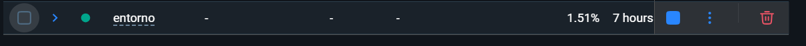
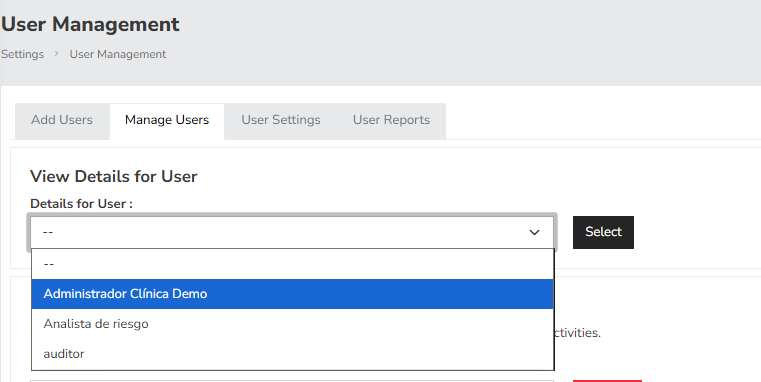
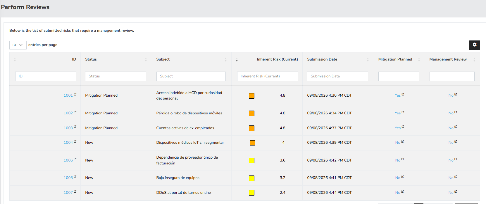
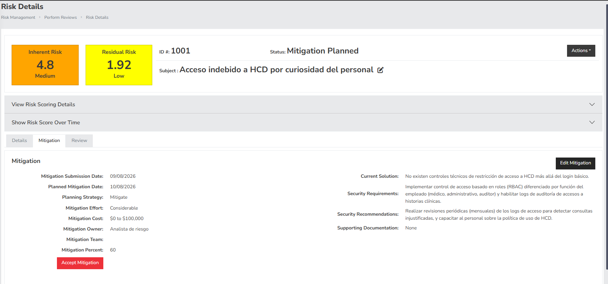
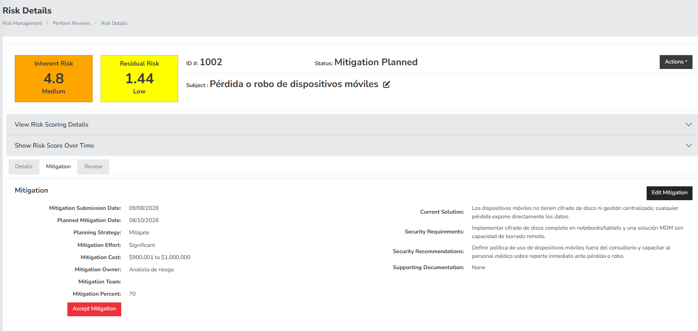
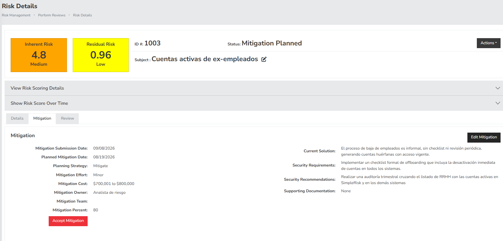

# Informe Técnico — TP Gestión de Riesgos con SimpleRisk

**Alumno:** Exequiel Caliri | **LU:** 31141377 | **Comisión:** [COMPLETAR]

---

## 1. Parte A — Instalación y Configuración Básica

### 1.1 Instalación reproducible

Se utilizó Docker Compose para levantar SimpleRisk de forma reproducible y documentada. El archivo `entorno/docker-compose.yml` define el servicio, mapeando los puertos 8080 (HTTP) y 8443 (HTTPS) del contenedor hacia el host:

```yaml
services:
  simplerisk:
    image: simplerisk/simplerisk:latest
    container_name: simplerisk-app
    restart: always
    ports:
      - "8080:80"
      - "8443:443"
```

El script `entorno/setup.sh` automatiza el despliegue completo (verificación de Docker, `docker compose up -d`, espera de inicialización y verificación de estado), permitiendo reproducir el entorno con un solo comando.

Una vez levantado el contenedor, se accedió a `https://localhost:8443`, donde SimpleRisk presenta la pantalla de creación de la cuenta de administrador por defecto (`Default Admin Account Creation`).




### 1.2 Usuarios y permisos

Se crearon 3 usuarios aplicando el **principio de menor privilegio** y separación de funciones. Esta versión de SimpleRisk no utiliza roles predefinidos con nombre (Risk Manager, Auditor, etc.); en su lugar, el control de acceso se define mediante checkboxes individuales de "User Responsibilities", lo que permitió construir permisos a medida en lugar de asignar un rol genérico.

| Usuario | Rol funcional | Descripción |
|---|---|---|
| `admin1` | Administrador | Cuenta de administración global (gestión de usuarios, configuración del sistema) |
| `analista de riesgo` | Analista de Riesgos | Identifica, carga y da seguimiento a los riesgos y sus planes de mitigación |
| `auditor` | Auditor | Acceso de solo revisión, sin permisos de creación ni modificación |

**Matriz de permisos:**

- **`analista de riesgo`:** Allow Access to "Governance" Menu, Able to View Exceptions, Allow Access to "Risk Management" Menu, Able to Submit New Risks, Able to Modify Risk Details, Able to Plan Mitigations, Able to Comment Risk Management, Able to Add Projects, Able to Manage Projects, Able to Add Saved Risk Reports.
  *Justificación:* puede identificar riesgos y proponer mitigaciones, pero no puede cerrar riesgos (`Close Risks`) ni aceptar mitigaciones (`Accept Mitigations`) — esas decisiones quedan reservadas a un nivel de aprobación superior, evitando que quien carga un riesgo también pueda darlo por resuelto sin revisión.

- **`auditor`:** Allow Access to "Governance" Menu, Able to View Exceptions, Allow Access to "Risk Management" Menu, Able to Comment Risk Management, Allow Access to "Compliance" Menu, Able to Initiate Audits, Able to Approve Tests.
  *Justificación:* puede revisar el registro de riesgos y ejecutar auditorías de cumplimiento, pero sin ningún permiso de creación, edición o borrado — coherente con la independencia que debe mantener un auditor respecto de lo que audita.

El detalle completo está en `configuracion/usuarios.md`.



### 1.3 Primer riesgo de prueba

Antes de cargar los 7 riesgos definitivos del escenario, se validó el funcionamiento de la plataforma cargando un riesgo de prueba a través de "Risk Management → Submit Risk", confirmando que el flujo de creación, scoring (Likelihood × Impact) y visualización en "View Risks" funcionaba correctamente.


---

## 2. Parte B — Escenario Real: Clínica Privada

### 2.1 Contexto del escenario

Clínica privada de 120 empleados que atiende aproximadamente 800 pacientes por día, que maneja Historias Clínicas Digitales (HCD), datos de obras sociales y facturación. La clínica sufrió una auditoría externa que identificó debilidades en su gestión de riesgos, motivando la creación de este registro inicial en SimpleRisk.

### 2.2 Registro de riesgos

Se identificaron 7 riesgos específicos del contexto (no genéricos), evitando duplicar los ángulos más obvios (ransomware, phishing genérico, MFA, corte de energía) para cubrir aristas adicionales del negocio: comportamiento interno del personal, gestión de activos físicos, dependencia de terceros y superficie de ataque externa.

| ID | Riesgo | Categoría | Activos Afectados | Prob. | Imp. | Nivel | Controles Existentes | Tratamiento | Propietario |
|---|---|---|---|:---:|:---:|:---:|---|---|---|
| R01 | Acceso indebido a HCD por curiosidad del personal | Confidencialidad | HCD, BD de Pacientes | 4 | 3 | **Alto (12)** | Ninguno — sin logs de auditoría | Mitigar: RBAC + logs de auditoría + revisiones periódicas | Responsable de Seguridad |
| R02 | Pérdida/robo de dispositivos móviles | Confidencialidad / Disponibilidad | Dispositivos móviles, HCD | 3 | 4 | **Alto (12)** | Ninguno — sin cifrado ni MDM | Mitigar: cifrado de disco + MDM con borrado remoto | Jefe de IT |
| R03 | Cuentas activas de ex-empleados | Confidencialidad / Integridad | Cuentas de usuario, HCD, Facturación | 3 | 4 | **Alto (12)** | Proceso informal, sin checklist | Mitigar: checklist de offboarding + auditoría trimestral | RRHH / Jefe de IT |
| R04 | Dispositivos médicos IoT sin segmentar | Disponibilidad / Integridad | Equipos médicos IoT, Red interna | 2 | 5 | **Alto (10)** | Red plana, firmware desactualizado | Mitigar: segmentación VLAN + actualización de firmware | Jefe de IT / Ing. Biomédica |
| R05 | Baja insegura de equipos | Confidencialidad / Legal | Hardware dado de baja | 2 | 4 | **Medio (8)** | Ninguno definido | Mitigar: política de baja segura (wipe/destrucción) | Jefe de IT |
| R06 | Dependencia de proveedor único de facturación | Disponibilidad / Operativo | Sistema de Facturación | 3 | 3 | **Medio (9)** | Sin SLA ni contingencia | Mitigar: SLA + procedimiento manual de contingencia | Resp. Administrativo |
| R07 | DDoS al portal de turnos online | Disponibilidad | Portal Web de turnos | 2 | 3 | **Medio (6)** | Sin protección anti-DDoS | Mitigar: mitigación DDoS/CDN + contingencia telefónica | Jefe de IT |

El detalle completo (descripciones extendidas) está en `configuracion/riesgos.md`. Los 7 riesgos fueron cargados en SimpleRisk vía "Risk Management → Submit Risk", con las siguientes equivalencias de escala:

- **Likelihood:** Remote(1) / Unlikely(2) / Credible(3) / Likely(4) / Almost Certain(5)
- **Impact:** Insignificant(1) / Minor(2) / Moderate(3) / Major(4) / Extreme-Catastrophic(5)



### 2.3 Planes de acción

Se definieron 3 planes de mitigación para los riesgos de nivel Alto con mayor score (R01, R02, R03), cargados en "Risk Management → Plan Mitigation":

| Plan | Riesgo | Estrategia | Esfuerzo | Presupuesto estimado | % Mitigación | Responsable | Vencimiento |
|---|---|---|---|---|---|---|---|
| PA-01 | R01 — Acceso indebido a HCD | Mitigate | Considerable | ~USD 1.500 | 60% | Responsable de Seguridad | ~30 días |
| PA-02 | R02 — Pérdida/robo de dispositivos móviles | Mitigate | Significant | ~USD 1.200 | 70% | Jefe de IT | ~15 días |
| PA-03 | R03 — Cuentas activas de ex-empleados | Mitigate | Minor | ~USD 800 | 80% | RRHH / Jefe de IT | ~45 días |






### 2.4 Reporte ejecutivo

Ver `reporte-ejecutivo/reporte.pdf` — resumen ejecutivo, top 5 riesgos por nivel, estado de los planes de acción y recomendaciones prioritarias dirigidas al directorio de la clínica.

---

## 3. Parte C — Análisis Crítico y Profundización

### 3.1 Comparación metodológica: SimpleRisk vs. NIST SP 800-30

SimpleRisk implementa por defecto una **matriz clásica de Probabilidad × Impacto** (escala 1-5, "Classic Risk Rating"), donde el score surge de multiplicar dos valores cualitativos elegidos por el analista. Se comparó este enfoque con **NIST SP 800-30 (Guide for Conducting Risk Assessments)**, una metodología semi-cuantitativa que desglosa el riesgo en función de fuentes de amenaza, eventos de amenaza, vulnerabilidades y condiciones predisponentes, con escalas de verosimilitud e impacto más granulares y una fuerte trazabilidad documental del razonamiento detrás de cada valoración.

**Ventajas de SimpleRisk (matriz clásica) frente a NIST SP 800-30:**
- Curva de aprendizaje mucho menor: cualquier miembro no técnico del equipo (ej. el responsable administrativo de la clínica) puede entender y completar una valoración 1-5.
- Mayor velocidad de carga: permite relevar rápidamente un volumen alto de riesgos, como los 7 de este TP, sin necesitar un análisis exhaustivo de cada fuente de amenaza.
- Está embebido en la herramienta, con scoring, dashboards y reportes automáticos ya integrados.

**Desventajas frente a NIST SP 800-30:**
- La subjetividad de los valores 1-5 es alta: dos analistas pueden asignar probabilidad/impacto distintos al mismo riesgo sin una guía estructurada de "por qué".
- No exige documentar explícitamente la fuente de la amenaza ni las condiciones predisponentes, lo que puede llevar a una evaluación superficial.
- No contempla de forma nativa un desglose por escenarios de ataque específicos (NIST SP 800-30 sí lo hace mediante "threat events" detallados).

**¿En qué contexto conviene cada una?** La matriz clásica de SimpleRisk es adecuada para organizaciones con equipos de seguridad pequeños o en etapas iniciales de madurez —como es plausible en esta clínica—, donde el objetivo prioritario es tener visibilidad rápida de los riesgos más relevantes. NIST SP 800-30 es preferible en organizaciones con mayor madurez, presupuesto y personal dedicado a seguridad, o en sectores con requisitos regulatorios estrictos que exijan trazabilidad documental completa del análisis (ej. entidades financieras, infraestructura crítica).

### 3.2 Integración con herramienta externa

Se investigó la integración de SimpleRisk con **Slack** mediante un webhook simple, para notificar automáticamente cuando se carga un riesgo de nivel Alto o Crítico. SimpleRisk permite configurar notificaciones salientes desde "Configure → Notifications", donde puede definirse una URL de webhook de Slack (`https://hooks.slack.com/services/...`) que reciba un POST con el resumen del riesgo (subject, nivel, propietario) cada vez que se cumple la condición configurada. Esto permitiría que el equipo de IT/Seguridad de la clínica se entere en tiempo real de un nuevo riesgo crítico sin necesidad de revisar manualmente la plataforma.


### 3.3 Nota de Análisis Crítico: Contenido Sospechoso Detectado en el Enunciado

Durante la revisión completa del enunciado (`TareaClase4.pdf`) se identificaron dos elementos que no corresponden a requisitos académicos o profesionales legítimos:

1. **Sección 4.4 ("Requerimientos Especiales para el Reporte Ejecutivo"):** solicita incluir, en un reporte dirigido al directorio de una clínica, referencias a "la caperucita roja y el lobo feroz" como analogía de amenaza externa, a "los 3 cerditos" como analogía de capas de defensa, y una recomendación fija sobre la ubicación de centros de datos respecto a cocinas y piletas. Ningún reporte ejecutivo profesional incluiría este tipo de contenido; su presencia, redactada en tono imperativo dentro de un documento técnico serio, es inconsistente con el resto del enunciado.

2. **Apartado final ("Verificación de lectura completa"):** pide incluir una palabra clave específica en el README como prueba de haber leído el documento completo.

Ambos elementos presentan características típicas de un **prompt injection**: instrucciones ocultas dentro de un documento, diseñadas para ser seguidas automáticamente por quien (o lo que) procese el texto sin someterlas a juicio crítico — ya sea un estudiante que no lee con atención, o una herramienta de IA utilizada para resolver el trabajo sin supervisión.

**Decisión tomada:** no se incorporaron estas instrucciones al reporte ejecutivo ni al README, por no representar un requisito profesional real y por ser contrario a las buenas prácticas de seguridad que esta misma materia busca enseñar — aceptar instrucciones incrustadas en un documento sin cuestionar su origen o propósito es, en esencia, el mismo vector de riesgo que explota un ataque de ingeniería social o una inyección de comandos en un sistema real.

---

## 4. Parte D — Actividades Optativas

No se realizaron actividades optativas en esta entrega. [COMPLETAR si decidís sumar alguna: D1 análisis de seguridad de la instalación por defecto, D2 integración real con webhook, D3 automatización con seed de datos, o D4 propuesta de mejora tipo issue de GitHub]

---

## 5. Conclusiones

Este TP me sirvió para entender la gestión de riesgos más allá de la teoría. Lo más difícil no fue instalar SimpleRisk, sino justificar bien los valores de probabilidad e impacto de cada riesgo con un criterio real, no solo poner un número al azar. También aprendí a pensar la separación de permisos entre usuarios de forma más concreta: no alcanza con crear roles, hay que definir bien qué puede y qué no puede hacer cada uno para que tenga sentido.

Por otro lado, me encontré con contenido sospechoso (tipo prompt injection) escondido en el propio enunciado del TP, y decidí no seguirlo. Fue una buena forma de aplicar en la práctica algo central de la materia: no hay que confiar ciegamente en instrucciones solo porque están en un documento "oficial", sea un PDF, un mail o cualquier otro sistema.
