# Informe — TP Gestión de Riesgos con SimpleRisk

**Alumno:** Uriel Cabrera — LU 31673361

---

## Parte A — Instalación y configuración básica

### A.1 Instalación reproducible

**Método elegido:** Docker Compose sobre la imagen oficial
`simplerisk/simplerisk`. La justificación de esta elección frente a la variante
`simplerisk-minimal` está detallada en el README, sección 3.1.

**Entorno de ejecución:** Windows 11 con Docker Desktop sobre backend WSL 2.

**Procedimiento:**

1. Verificación de que la virtualización esté habilitada en la UEFI/BIOS y de
   que Docker Desktop opere sobre WSL 2.
2. Descarga de la imagen: `docker compose pull`.
3. Levantamiento del contenedor: `docker compose up -d`.
4. Verificación del estado: `docker ps`.
5. Acceso a `https://localhost:8443` y creación de la cuenta administradora.

El archivo `entorno/setup.sh` automatiza los pasos 2 a 5, incorporando además
la verificación previa de prerrequisitos (presencia de Docker, disponibilidad
del daemon y de los puertos 8080/8443) y una espera activa hasta que la
aplicación responda.

**Verificación del despliegue:**

El contenedor `simplerisk_app` se reporta como `Up (healthy)`, con los puertos
`8080→80` y `8443→443` publicados. El estado *healthy* proviene del
`healthcheck` declarado en `docker-compose.yml`, que consulta la aplicación por
HTTPS aceptando el certificado autofirmado. Es decir, la verificación no
confirma únicamente que el contenedor esté en ejecución, sino que la aplicación
responde efectivamente por el puerto esperado.

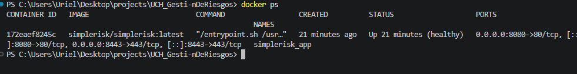

*Contenedor simplerisk_app en estado Up (healthy), con los puertos 8080 y 8443 publicados*

**Observación sobre credenciales iniciales:**

En el primer acceso, la aplicación presenta la pantalla *Default Admin Account
Creation*. SimpleRisk no distribuye una cuenta administradora preconfigurada:
obliga a definir usuario y contraseña durante la instalación. Esto elimina el
riesgo asociado a credenciales por defecto conocidas, que constituye una de las
debilidades más habituales en despliegues de aplicaciones web y una vía de
acceso inicial frecuentemente explotada.

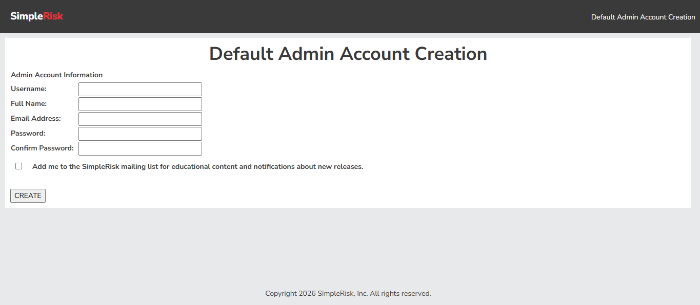

*Pantalla Default Admin Account Creation: la aplicación exige definir la cuenta administradora en el primer acceso*

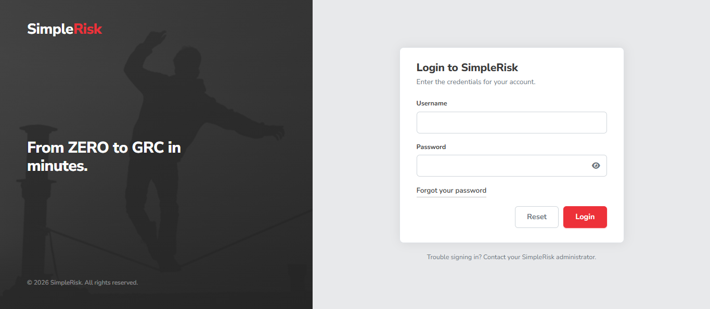

*Pantalla de acceso en `localhost:8443`. La advertencia del navegador corresponde al certificado autofirmado que genera la imagen*

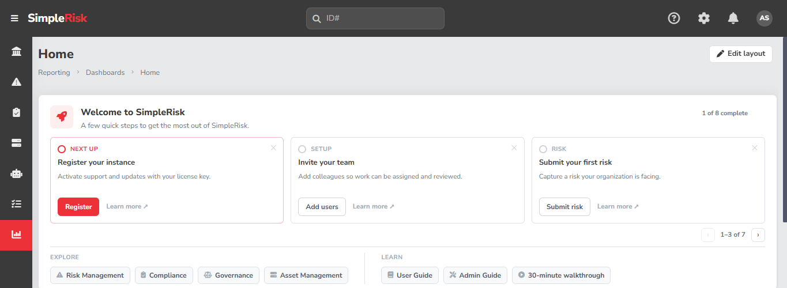

*Aplicación operativa tras el primer ingreso*

### A.2 Usuarios y permisos

Se definieron tres usuarios con roles diferenciados: administrador, analista de
riesgos y auditor interno. La matriz completa de permisos, con la denominación
exacta que emplea SimpleRisk, está en `../configuracion/usuarios.md`.

**Modelo de asignación.** SimpleRisk permite asignar permisos por dos vías: un
rol predefinido seleccionable desde el formulario de alta, o la asignación
granular mediante la sección *User Responsibilities*. Se optó por la asignación
granular para que cada permiso otorgado responda a una decisión explícita y
documentable, en lugar de heredar un conjunto cuyo contenido no queda registrado
en la entrega.

**Criterios aplicados.** La configuración no se limita a diferenciar niveles de
acceso, sino que materializa tres principios:

1. *Menor privilegio.* El auditor conserva únicamente permisos de acceso a los
   módulos y visualización de excepciones. No posee ninguna capacidad de
   creación, modificación, aprobación ni eliminación.

2. *Separación de funciones.* El analista puede planificar mitigaciones pero no
   aceptarlas. La propuesta de tratamiento y su aprobación quedan en manos
   distintas, de modo que ninguna cuenta controla por sí sola el ciclo completo
   de decisión sobre un riesgo.

3. *Escalamiento por criticidad.* El analista revisa riesgos hasta nivel medio;
   los niveles alto y muy alto quedan reservados al administrador. Esto guarda
   coherencia con la escala adoptada, donde el nivel Crítico implica
   escalamiento a dirección.

**Verificación.** La restricción no se declara únicamente por configuración: se
comprobó iniciando sesión con la cuenta del auditor y constatando que la interfaz
efectivamente no ofrece las acciones restringidas. La diferencia más visible es
la ausencia del ícono de configuración en la barra superior, presente en la
sesión del administrador. El auditor visualiza el riesgo registrado y los paneles
de reporte, pero la interfaz no le expone ninguna acción de creación o
modificación.

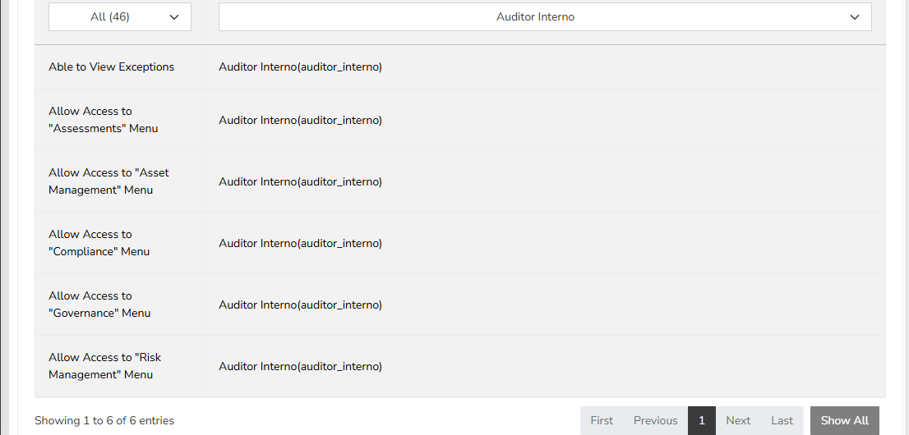

*Permisos del auditor: seis en total, todos de acceso de lectura. Ninguna capacidad de creación, modificación o eliminación*

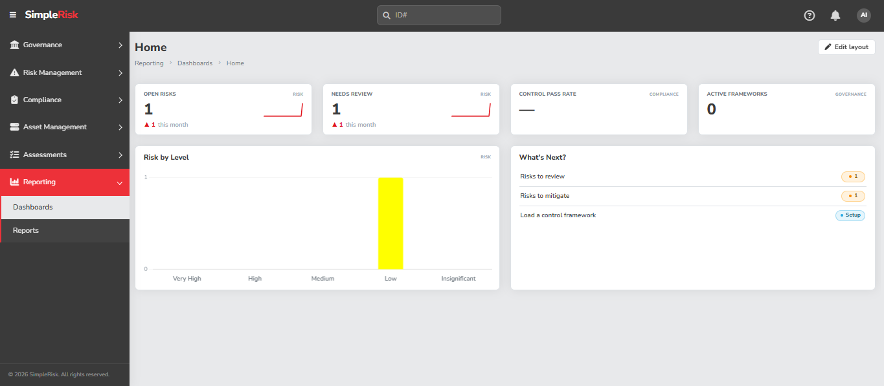

*Sesión iniciada como auditor_interno: la barra superior no ofrece el ícono de configuración presente en la sesión del administrador*

<b>Ver el resto de la evidencia de la Parte A.2</b> (5 capturas)

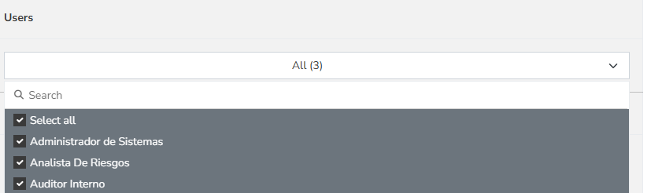

*Los tres usuarios dados de alta*

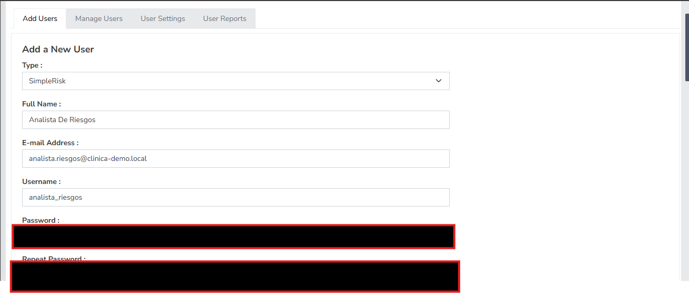

*Datos de identidad del analista de riesgos*

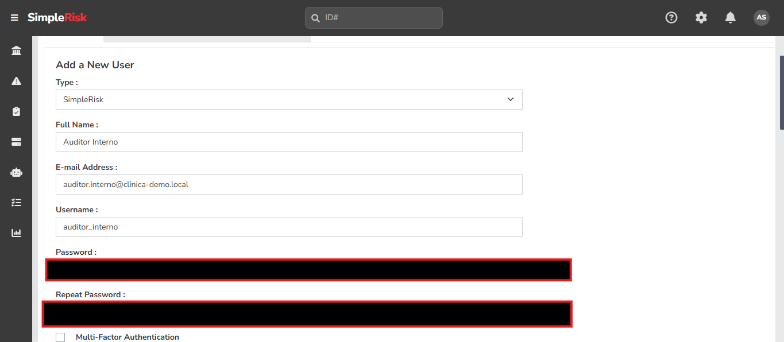

*Datos de identidad del auditor interno*

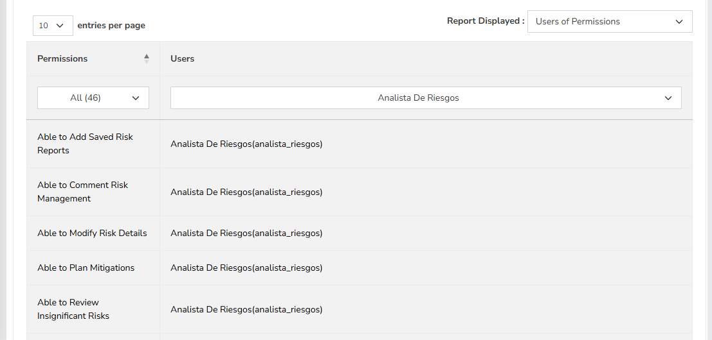

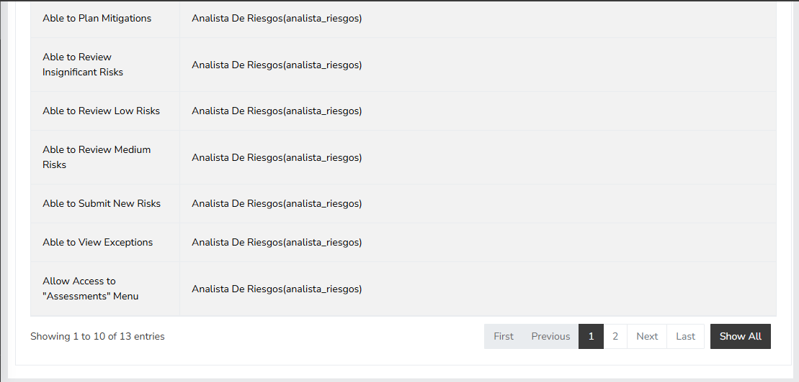

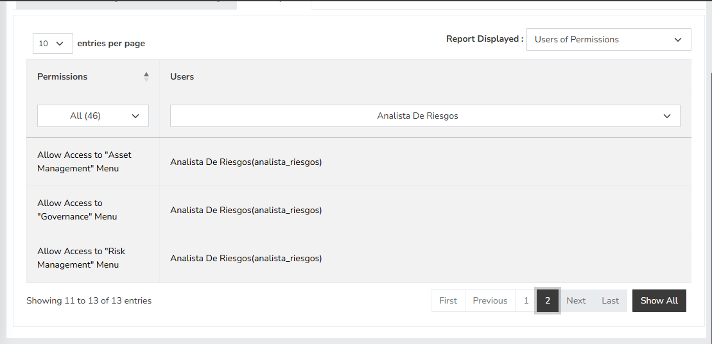

*Los 13 permisos del analista de riesgos*

### A.3 Primer riesgo de prueba

Se registró un riesgo de validación con el asunto *PRUEBA - Validación de alta de
riesgos*, identificado explícitamente como tal para no confundirlo con el registro
de riesgos del escenario, que se desarrolla en la Parte B.

| Campo | Valor |
|---|---|
| ID | 1001 |
| Categoría | Policy and Procedure |
| Origen del riesgo | Process |
| Método de scoring | Classic |
| Probabilidad actual | Credible (3) |
| Impacto actual | Moderate (3) |
| Tecnología | Backups |
| Equipo | Information Security |
| Propietario | Analista De Riesgos |
| Manager del propietario | Administrador de Sistemas |
| Estado | New |

**Resultado obtenido.** Con la configuración que trae la instalación por defecto,
SimpleRisk calculó un riesgo inherente y residual de **3.6**, clasificado como
*Low*. El riesgo residual coincide con el inherente porque aún no se registraron
controles ni mitigaciones sobre él.

**Inconsistencia detectada.** Ese resultado no se correspondía con la valoración
esperada. Según la escala de la plantilla A03, una probabilidad *Posible* (3)
combinada con un impacto *Moderado* (3) arroja un valor de 9, que cae dentro del
rango 5–9 y por lo tanto corresponde al nivel **Medio**. La aplicación mostraba
en cambio 3.6 y lo clasificaba como *Low*.

La discrepancia no era menor: un riesgo de nivel medio presentado como bajo puede
quedar fuera de un plan de tratamiento. Esto motivó revisar la configuración de
scoring de la herramienta antes de continuar con el registro de riesgos del
escenario, ya que de haberse mantenido, los siete riesgos de la Parte B habrían
quedado sistemáticamente subvaluados respecto del instrumento de la cátedra.

El análisis de esa revisión y la configuración finalmente adoptada se desarrollan
en la Parte C, sección C.1. La configuración resultante está documentada en el
README, sección 3.4.

**Validación funcional del entorno.** Independientemente del ajuste posterior, el
alta del riesgo confirma que la cadena completa opera correctamente: la
aplicación acepta el formulario, persiste el registro en la base de datos,
calcula el score conforme a la fórmula configurada y lo refleja en el panel de
reportes.

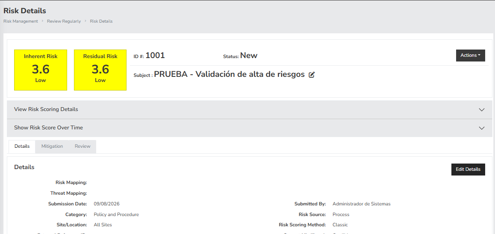

*Riesgo 1001 con la configuración por defecto: 3.6 / Low, resultado que no coincidía con el valor 9 (Medio) de la plantilla A03*

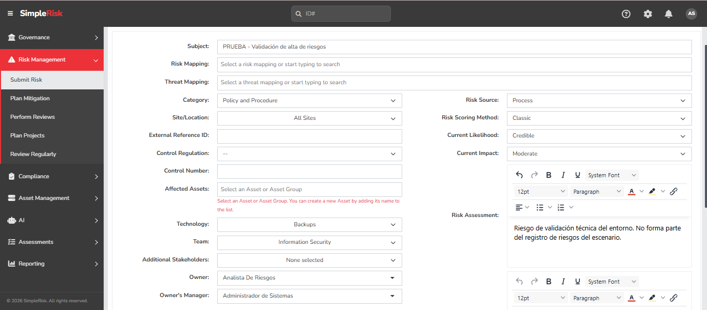

*Formulario de alta del riesgo de validación*

---

## Parte B — Escenario real

### Contexto y supuestos

El enunciado aporta cinco datos sobre la organización: 120 empleados, 800
pacientes diarios, historias clínicas digitales, datos de obras sociales y
facturación, y una auditoría externa reciente que identificó debilidades en la
gestión de riesgos. Todo análisis de riesgos requiere además conocer la
infraestructura, la dotación técnica y el marco normativo aplicable, de modo que
se asumen los siguientes supuestos, explicitados porque cada uno sostiene al
menos una de las valoraciones del registro:

| # | Supuesto | Valoraciones que sostiene |
|---|---|---|
| S1 | Área de sistemas de dos a tres personas, sin rol dedicado a seguridad de la información | Probabilidad de R01, R03 |
| S2 | Historia clínica electrónica de proveedor externo, alojada en servidores propios de la clínica, con soporte remoto del proveedor | Impacto de R01; alcance de R07 |
| S3 | Sala de servidores propia dentro del edificio, sin redundancia de centro de datos | Probabilidad e impacto de R06 |
| S4 | Personal asistencial con alta rotación y usuarios compartidos por turno en algunos sectores | Probabilidad de R02 |
| S5 | Red interna sin segmentación entre el segmento clínico y el administrativo | Probabilidad de R01 |
| S6 | Backups diarios automatizados a disco local, sin copia fuera de línea ni prueba de restauración documentada | Probabilidad e impacto de R05 |
| S7 | Marco normativo aplicable: Ley 25.326 de Protección de los Datos Personales. Los datos de salud revisten carácter de datos sensibles y están sujetos a un régimen agravado | Impacto de R02, R04; existencia de R07 |
| S8 | Intercambio mensual de planillas de facturación con obras sociales por correo electrónico, sin procedimiento formalizado | Probabilidad de R04 |

Estos supuestos describen una organización verosímil para el tamaño y el rubro
indicados: una clínica de porte medio con sistemas digitalizados pero sin una
función de seguridad de la información constituida, que es precisamente la
situación que la auditoría externa vino a señalar.

### Registro de riesgos

Se identificaron siete riesgos específicos del contexto de la clínica. El
registro completo —con descripción, activos afectados, justificación individual
de cada valor de probabilidad e impacto, controles existentes y plan de
tratamiento— está en `../configuracion/riesgos.md`.

**Criterio de selección.** El conjunto cubre deliberadamente las tres dimensiones
clásicas de la seguridad de la información y agrega la dimensión legal, que en
una institución de salud no es accesoria:

| Dimensión | Riesgos |
|---|---|
| Confidencialidad | R02, R03, R04 |
| Integridad | R01, R03 |
| Disponibilidad | R01, R05, R06 |
| Legal | R04, R07 |

Ninguno de los siete es un riesgo genérico aplicable a cualquier organización:
todos se apoyan en una característica propia del escenario —el volumen de
atención diaria, la naturaleza sensible de la historia clínica, el vínculo
operativo con obras sociales o la infraestructura descrita en los supuestos.

**Carga en la herramienta.** Los siete riesgos fueron registrados en SimpleRisk
con la cuenta `analista_riesgos`, que es el rol al que corresponde la
identificación y valoración según la matriz de permisos de la Parte A.2. El campo
*Submitted By* de cada riesgo deja constancia de ello, lo que verifica en la
práctica que el permiso *Able to Submit New Risks* opera como fue configurado.

Cada riesgo lleva su código del registro en el campo *External Reference ID*, y
la justificación de probabilidad e impacto se transcribió en *Additional Notes*,
de modo que el razonamiento resulte consultable desde la propia herramienta y no
únicamente desde este repositorio.

| Ref | ID SimpleRisk | Valor | Nivel |
|---|:-:|:-:|---|
| R01 | 1002 | 20 | Very High |
| R02 | 1003 | 16 | Very High |
| R03 | 1004 | 16 | Very High |
| R04 | 1005 | 16 | Very High |
| R05 | 1006 | 15 | High |
| R07 | 1008 | 12 | High |
| R06 | 1007 | 9 | Medium |

Los valores y niveles calculados por SimpleRisk coinciden exactamente con los de
la plantilla A03 consignados en `../configuracion/riesgos.md`, lo que confirma
que la configuración de scoring descrita en el README, sección 3.4, produce el
resultado buscado.

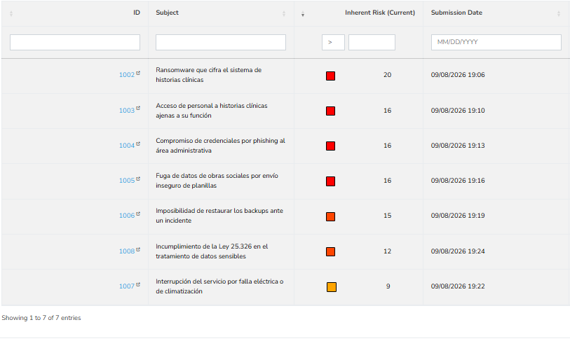

*Los siete riesgos registrados en SimpleRisk con sus niveles, ordenados por valor descendente*

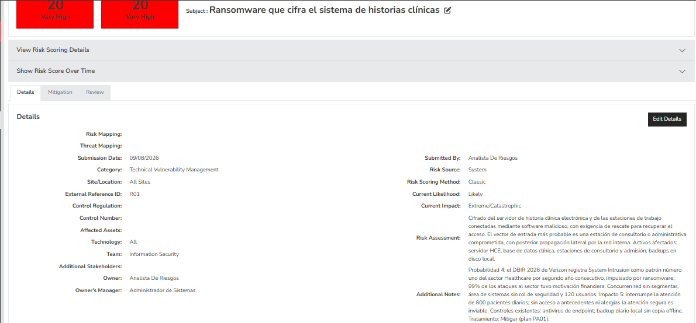

*Ficha completa de R01: valoración, justificación en Additional Notes y External Reference ID*

<b>Ver las fichas de los seis riesgos restantes</b>

*R02 — Acceso de personal a historias clínicas ajenas a su función*

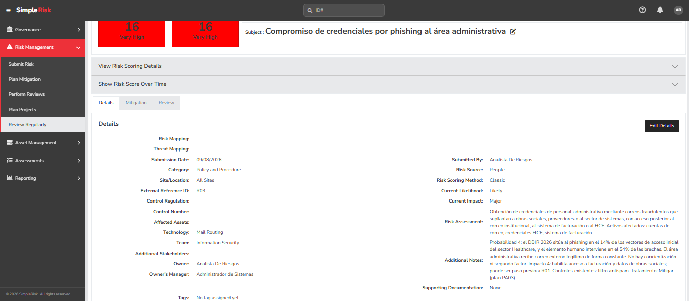

*R03 — Compromiso de credenciales por phishing al área administrativa*

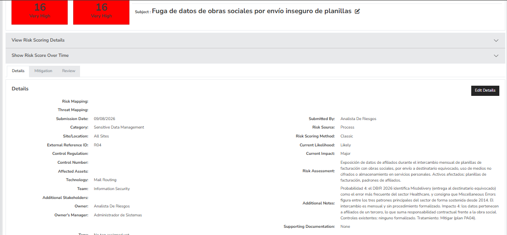

*R04 — Fuga de datos de obras sociales por envío inseguro de planillas*

*R05 — Imposibilidad de restaurar los backups ante un incidente*

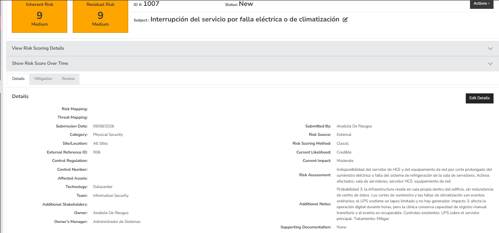

*R06 — Interrupción del servicio por falla eléctrica o de climatización*

*R07 — Incumplimiento de la Ley 25.326 en el tratamiento de datos sensibles*

**Distribución resultante.** Cuatro riesgos de nivel Crítico, dos de nivel Alto y
uno Medio. La concentración en los niveles superiores es coherente con el punto
de partida planteado en el enunciado: una organización que acaba de recibir una
auditoría con hallazgos y que aún no implementó controles sistemáticos.

**Incidencia de la evidencia sectorial sobre las valoraciones.** Las
probabilidades se contrastaron contra el *2026 Data Breach Investigations Report*
de Verizon, en su edición correspondiente al sector Healthcare. El contraste no
fue meramente confirmatorio: modificó el registro en dos puntos.

R04 —fuga de datos por envío inseguro de planillas— había sido valorado
inicialmente con probabilidad 3. El informe identifica *Misdelivery* como el error
más frecuente del sector y consigna que el patrón de errores diversos figura entre
los tres principales de forma sostenida desde 2014. Esa evidencia justificó
elevarlo a 4, con lo que el riesgo pasó de nivel Alto a Crítico. El resultado es
contraintuitivo y por eso relevante: un error administrativo cotidiano alcanza el
mismo nivel que un ataque de ransomware.

En sentido inverso, R02 —acceso indebido a historias clínicas— encontró un dato
en contra: el patrón *Privilege Misuse* representa apenas el 3 % de las brechas
del sector, en descenso sostenido. Se mantuvo la valoración en 4 por las
condiciones específicas de la organización, dejando constancia expresa de la
tensión en la ficha del riesgo. Un registro que sólo incorpora la evidencia
favorable a sus conclusiones no resiste una revisión externa.

### Planes de acción

Se definieron seis planes que cubren la totalidad de los riesgos identificados.
El detalle de cada uno —descripción, justificación de la prioridad y alcance—
está en `../configuracion/riesgos.md`.

| Plan | Objetivo | Riesgos | Plazo | Responsable | Presupuesto | Estado |
|---|---|---|:-:|---|---:|---|
| PA01 | Respaldo verificado y contención de propagación | R01, R05 | 90 días | Responsable de Sistemas | USD 12.000 | No iniciado |
| PA02 | Trazabilidad y perfilado de accesos a la historia clínica | R02 | 60 días | Responsable de Sistemas | USD 3.500 | No iniciado |
| PA03 | Segundo factor de autenticación y concientización | R03 | 120 días | Jefe de Administración | USD 5.000 | No iniciado |
| PA04 | Procedimiento seguro de intercambio con obras sociales | R04 | 45 días | Jefe de Administración | USD 1.500 | No iniciado |
| PA05 | Regularización del tratamiento de datos sensibles | R07 | 180 días | Dirección General | USD 2.500 | No iniciado |
| PA06 | Redundancia eléctrica y de climatización | R06 | 150 días | Jefe de Mantenimiento | USD 8.000 | No iniciado |
| | | | | **Total** | **USD 32.500** | |

**Criterio de priorización.** El orden de vencimientos no replica el orden de
severidad. PA04 vence primero y es el más económico pese a atender un riesgo
Crítico, porque se resuelve definiendo un procedimiento y no adquiriendo
tecnología; ofrece por lo tanto la mayor reducción de riesgo por unidad de
inversión. PA03, en cambio, tiene el plazo más extenso porque su componente de
concientización sólo produce efecto medible sostenido en el tiempo. PA05 y PA06
integran un segundo ciclo: atienden riesgos que no presentan materialización
súbita y cuya ejecución depende de terceros —asesoría legal y proveedores de
equipamiento— o admite respuesta operativa transitoria.

**Carga en la herramienta.** Las mitigaciones se registraron con la cuenta
`analista_riesgos`, que posee *Able to Plan Mitigations* pero no *Able to Accept
Mitigations*: puede proponer un tratamiento, no aprobarlo. La separación de
funciones declarada en la Parte A.2 opera efectivamente sobre el ciclo de vida
del riesgo.

Al registrar la mitigación, el estado del riesgo pasó de *New* a
**Mitigation Planned**, y el riesgo residual se mantuvo idéntico al inherente en
los siete casos, dado que el campo *Mitigation Percent* se cargó en 0: ningún
plan fue ejecutado todavía.

**Limitaciones de la herramienta observadas durante la carga.** Se registran dos,
ambas relevantes para el análisis de la Parte C:

1. *La mitigación es un atributo del riesgo, no una entidad independiente.*
   SimpleRisk no permite asociar un mismo plan a varios riesgos, por lo que PA01
   —que atiende conjuntamente R01 y R05— debió cargarse por duplicado. La
   herramienta no puede representar que dos riesgos comparten un control.

2. *La escala de costos no discrimina en organizaciones pequeñas.* El campo
   *Mitigation Cost* ofrece rangos de cien mil dólares. Los seis planes, que van
   de USD 1.500 a USD 12.000, quedan todos en el primer tramo pese a que el más
   costoso multiplica por ocho al más económico.

Se registra además que *Planning Strategy* no ofrece la estrategia **Evitar**,
contemplada en el enunciado y en la bibliografía de la materia. La herramienta
admite Accept, Mitigate, Transfer, Research y Watch, de modo que no permite
documentar la decisión de discontinuar la actividad que origina un riesgo.

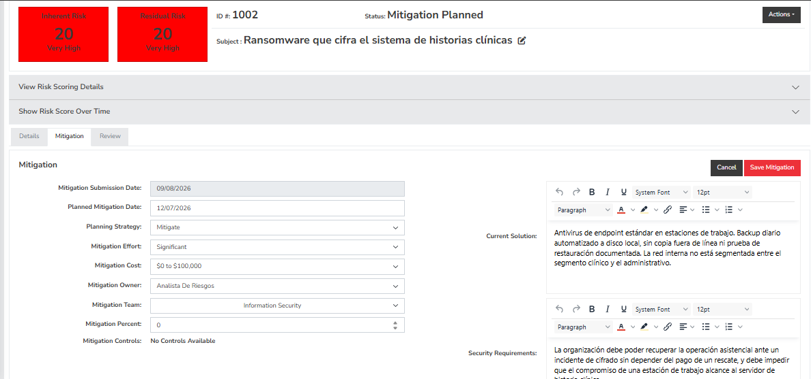

*Mitigación de R01: el estado pasó a Mitigation Planned y el riesgo residual se mantiene en 20, igual al inherente*

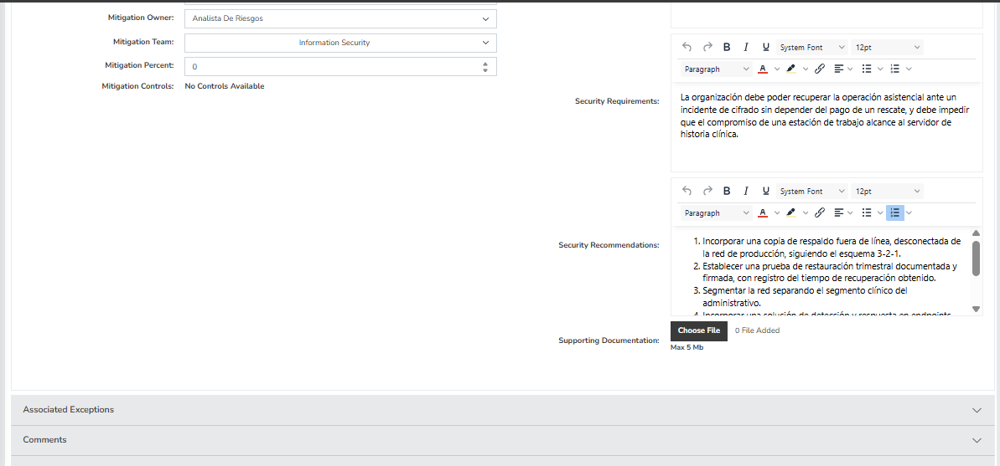

*Requisitos y recomendaciones de seguridad del plan PA01*

### Reporte ejecutivo

Se elaboró un reporte de tres páginas dirigido al Directorio de la clínica,
disponible en `../reporte-ejecutivo/reporte.pdf`. El fuente LaTeX se incluye en
la misma carpeta para permitir su verificación y recompilación.

El documento fue redactado con criterio de comunicación gerencial: prescinde de
terminología técnica, expresa cada riesgo en términos de su efecto sobre la
operación asistencial y la exposición legal de la institución, y concentra las
decisiones que requieren aprobación del Directorio. Contiene el resumen
ejecutivo, la distribución de riesgos por nivel, el top 5 por severidad, el
estado de los seis planes de acción con su presupuesto consolidado y cuatro
recomendaciones prioritarias.

La recomendación de mayor peso no es la más costosa: se propone aprobar de
inmediato PA02 y PA04, que suman USD 5.000 y atienden dos riesgos de nivel
Crítico, por ser los de mayor reducción de riesgo por unidad de inversión.

---

## Parte C — Análisis crítico

### C.1 Comparación metodológica

Se compara el enfoque de SimpleRisk —matriz Probabilidad × Impacto— con **FAIR**
(*Factor Analysis of Information Risk*), estandarizado por The Open Group en el
Risk Taxonomy Standard (O-RT) versión 3.0 y el Risk Analysis Standard (O-RA)
versión 2.0. Se eligió FAIR porque es la alternativa que aborda directamente la
limitación detectada durante la configuración del entorno, descrita a
continuación.

#### El hallazgo que motivó la comparación

Durante la Parte A se advirtió que el resultado del riesgo de validación no
coincidía con el que arrojaba la plantilla A03 para la misma valoración. El
rastreo de esa diferencia reveló que un mismo análisis podía comunicar tres
severidades distintas según cómo estuviera configurada la herramienta:

| Configuración de SimpleRisk | Valor mostrado | Nivel comunicado | Nivel según A03 |
|---|:-:|---|---|
| Normalización activada, umbrales por defecto | 3.6 | Low | Medio |
| Normalización desactivada, umbrales por defecto | 9 | High | Medio |
| Normalización desactivada, umbrales alineados | 9 | Medium | Medio |

La causa de la segunda fila es que los umbrales de la instalación
(10.1 / 7.0 / 4.0 / 0.0) están dimensionados para una escala de 0 a 10; aplicados
sobre valores de 1 a 25 desplazan la clasificación hacia arriba. La configuración
por defecto subvaluaba y su corrección parcial sobrevaluaba.

El episodio no es una anécdota de configuración. Expone que la etiqueta de nivel
—que es lo que determina la asignación de presupuesto y la urgencia del
tratamiento cuando el registro llega a Dirección— depende de decisiones que rara
vez se documentan y que el lector del reporte no puede inferir del resultado.

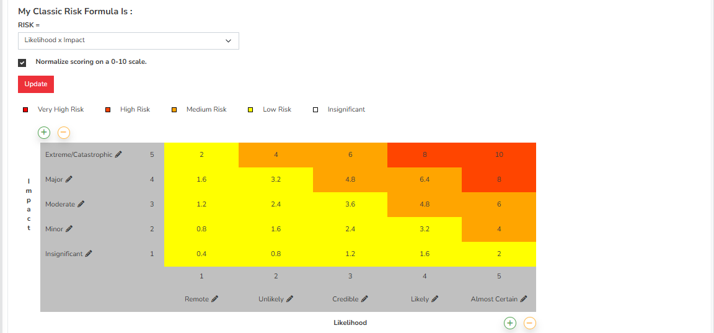

*Matriz con la normalización a 0–10 activada, tal como viene la instalación: la celda 3×3 muestra 3.6*

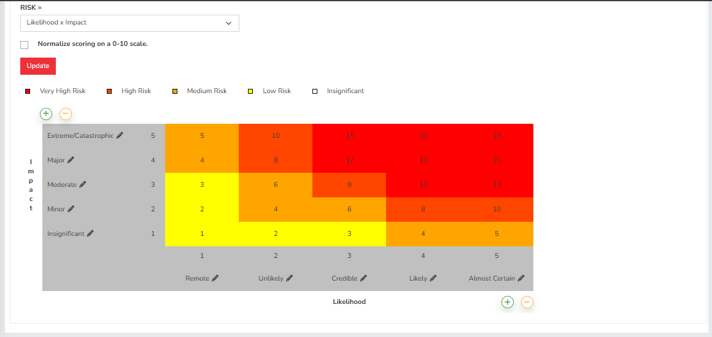

*La misma matriz con la normalización desactivada: la celda 3×3 muestra 9, pero los colores revelan que los umbrales quedaron desalineados*

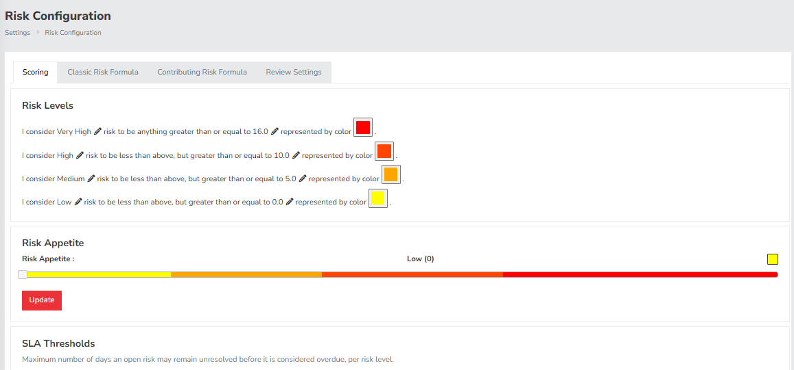

*Umbrales finales, alineados a los cortes de la plantilla A03*

<b>Ver el efecto sobre el riesgo de validación</b>

*Con normalización: 3.6 / Low — es la misma captura de la Parte A.3, reproducida aquí para la comparación*

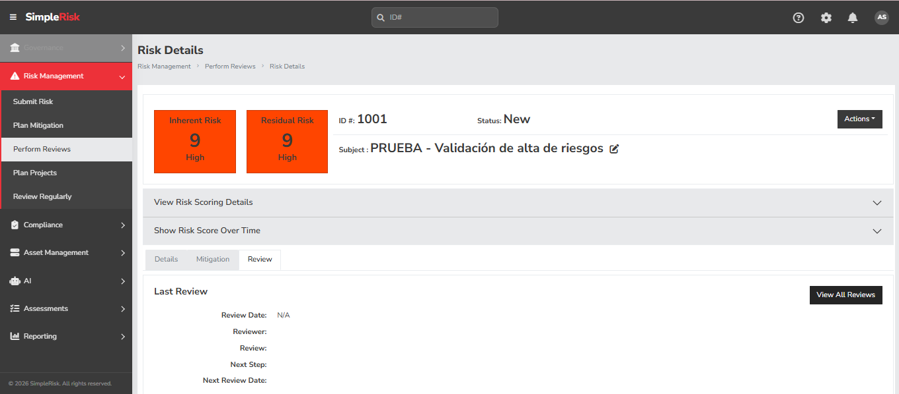

*Sin normalización y con umbrales sin ajustar: 9 / High*

#### En qué consiste FAIR

FAIR define el riesgo como la frecuencia probable y la magnitud probable de
pérdida futura que un stakeholder primario soportará dentro de un período
determinado. La diferencia inicial con el enfoque de la matriz es que FAIR no
califica riesgos: los **mide**, y los expresa en unidades monetarias anualizadas.

Para lograrlo descompone el riesgo en dos ramas:

- **Frecuencia de eventos de pérdida** (*Loss Event Frequency*), que a su vez se
  descompone en la frecuencia de eventos de amenaza y la vulnerabilidad,
  entendida como la fracción de eventos de amenaza que efectivamente derivan en
  pérdida.
- **Magnitud de pérdida** (*Loss Magnitude*), compuesta por la pérdida primaria
  —el costo económico directo del evento— y la pérdida secundaria, que incorpora
  la probabilidad condicional de que la pérdida primaria genere consecuencias
  adicionales y su magnitud. Las estimaciones se agregan por tipo de pérdida:
  productividad, respuesta al incidente, reemplazo de activos, multas y
  sentencias, ventaja competitiva y reputación.

Cada factor se estima en rangos —mínimo, más probable, máximo— con un nivel de
confianza asociado, y el conjunto se procesa mediante simulación para obtener una
distribución de pérdida esperada. El estándar es explícito en un punto que
conviene destacar: **las mediciones de riesgo no son predicciones**, sino
estimaciones que pueden resultar acertadas o no. FAIR no promete certeza; promete
una estructura para razonar sobre la incertidumbre.

Un requisito formal del método merece mención: FAIR exige que todo escenario de
pérdida esté correctamente delimitado indicando amenaza, activo y efecto. Varios
de los riesgos de este registro cumplen ese estándar, pero R07 —incumplimiento
normativo— no encajaría sin reformularse, por tratarse de un estado permanente y
no de un evento.

#### Contraste entre ambos enfoques

**1. Naturaleza de la escala.** La matriz produce números ordinales disfrazados
de cantidades. En este registro R01 obtuvo 20 y R05 obtuvo 15, pero esa
diferencia no significa que R01 sea un tercio peor: 4 × 5 y 3 × 5 son
multiplicaciones entre etiquetas ordenadas, no entre magnitudes. La operación es
aritméticamente inválida aunque el resultado se vea como un número. FAIR opera
sobre cantidades reales, donde la diferencia entre dos resultados sí es
interpretable.

**2. Decidibilidad económica.** Esta es la limitación más severa en términos
prácticos. El plan PA01 requiere USD 12.000 y atiende un riesgo valorado en 20.
**La matriz no permite establecer si esa inversión se justifica**, porque un
riesgo de "20" y un costo de doce mil dólares son magnitudes incomparables: no
comparten unidad. Bajo FAIR la pregunta se vuelve respondible, al contrastar la
pérdida anualizada esperada del escenario contra el costo del control.

Lo mismo ocurre en sentido inverso con PA06: USD 8.000 sobre el riesgo de menor
nivel del registro. La matriz no ofrece herramientas para discutir si esa
asignación es razonable; sólo permite señalar que el riesgo es Medio.

**3. Dependencia de la configuración.** Es el hallazgo descrito arriba. La
aparente objetividad del número producido por la matriz descansa sobre
convenciones —escala de presentación, cortes de clasificación— que se fijan una
vez y luego se vuelven invisibles. FAIR no elimina la subjetividad, pero la
desplaza a un lugar donde queda expuesta: las estimaciones de frecuencia y
magnitud son explícitas, se declaran en rangos y llevan un nivel de confianza
asociado. La incertidumbre se documenta en lugar de disolverse en una etiqueta.

**4. Granularidad del análisis.** La matriz trata cada riesgo como una unidad con
dos atributos. FAIR lo descompone en factores estimables por separado, lo que
permite identificar dónde un control actúa efectivamente. En R01, por ejemplo,
la segmentación de red reduce la vulnerabilidad mientras que el respaldo fuera de
línea reduce la magnitud de pérdida: son dos efectos distintos que la matriz
agrupa bajo una única reducción de nivel.

**5. Limitaciones adicionales observadas en la herramienta.** Durante la carga de
las mitigaciones se registraron tres restricciones que no derivan de la
metodología sino de su implementación en SimpleRisk, y que refuerzan el
diagnóstico general:

- La mitigación es un atributo del riesgo y no una entidad independiente, por lo
  que un plan que atiende dos riesgos debe duplicarse. La herramienta no puede
  representar que dos riesgos comparten un control.
- El campo de costo de mitigación ofrece rangos de cien mil dólares. Los seis
  planes de este trabajo, entre USD 1.500 y USD 12.000, quedan indistinguibles
  entre sí.
- El campo de estrategia de tratamiento no incluye **Evitar**, contemplada en el
  enunciado y en la bibliografía de la materia.

#### Ventajas del enfoque de SimpleRisk

El contraste anterior no convierte a la matriz en un instrumento inadecuado.
Sus ventajas son reales y explican su predominio:

**Costo de aplicación mínimo.** Los siete riesgos de este trabajo se valoraron
con dos decisiones por riesgo. Un análisis FAIR equivalente habría exigido
estimar frecuencia de contacto, probabilidad de acción, capacidad de la amenaza,
resistencia del control y seis formas de pérdida por escenario, con datos que la
clínica no posee.

**Comunicabilidad.** El registro debe ser comprendido por Dirección Médica, por
el Jefe de Administración y por el Jefe de Mantenimiento, ninguno de ellos
especialista en riesgo. "Crítico" comunica de inmediato; una distribución de
pérdida anualizada requiere alfabetización estadística que no puede presuponerse.

**No exige datos históricos.** FAIR necesita insumos —frecuencias observadas,
costos de incidentes previos— que una organización sin función de seguridad
constituida no ha recolectado. La matriz opera con juicio experto estructurado,
que es lo único disponible en el punto de partida de esta clínica.

**Trazabilidad inmediata.** La matriz permite reconstruir cómo se llegó a un
resultado con dos valores. Un análisis FAIR requiere documentar decenas de
estimaciones para que un tercero pueda auditarlo.

#### Contexto de aplicación de cada enfoque

| Criterio | Favorece a la matriz P × I | Favorece a FAIR |
|---|---|---|
| Madurez de la función de seguridad | Inicial o inexistente | Consolidada |
| Disponibilidad de datos históricos | Nula o escasa | Suficiente |
| Objetivo del análisis | Identificar y priorizar | Justificar inversión |
| Audiencia | No especializada | Dirección financiera, comité de riesgos |
| Cantidad de riesgos a evaluar | Muchos, para barrido inicial | Pocos, seleccionados |
| Magnitud de la inversión en juego | Baja | Alta |
| Requisito regulatorio o de aseguradora | No aplica | Frecuentemente exigido |

#### Conclusión aplicada al caso

Para el estado actual de la clínica, el enfoque de SimpleRisk es el adecuado. La
organización no tenía registro alguno de riesgos hasta esta intervención; lo que
necesita en este ciclo es identificar, dimensionar y priorizar con rapidez, y
producir un documento que el Directorio pueda leer y sobre el cual pueda decidir.
FAIR, aplicado íntegramente en este punto, habría consumido el tiempo disponible
en estimar parámetros sin producir el registro que la auditoría externa reclamaba.

La conclusión no es, sin embargo, que una metodología sea superior a la otra,
sino que corresponden a momentos distintos del ciclo de madurez. Se propone en
consecuencia un **uso selectivo de FAIR en el segundo ciclo de gestión**,
restringido a los escenarios donde la decisión de inversión lo justifique:

- **R01**, cuyo plan asociado requiere USD 12.000 y donde el análisis cuantitativo
  permitiría además contrastar el costo del control contra la alternativa de
  transferir parte del riesgo mediante un seguro de ciberseguridad.
- **R06**, cuyo plan demanda USD 8.000 sobre el riesgo de menor nivel del
  registro, y donde un análisis cuantitativo permitiría verificar si esa
  asignación es proporcionada o si convendría postergarla en favor de otros
  controles.

En ambos casos la pregunta que la matriz no puede responder —si el control vale
lo que cuesta— es precisamente la que el Directorio formulará al momento de
aprobar el presupuesto.

### C.2 Integración con herramienta externa
*(Pendiente.)*

---

## Referencias

- Ley 25.326 de Protección de los Datos Personales (Argentina).
- The Open Group (2020). *Risk Taxonomy (O-RT) Standard, Version 3.0*.
- The Open Group (2020). *Risk Analysis (O-RA) Standard, Version 2.0*.
- FAIR Institute. *What is FAIR*. https://www.fairinstitute.org/what-is-fair
- Verizon Business (2026). *2026 Data Breach Investigations Report — Healthcare
  snapshot*.
- ISO/IEC 27005: Information security risk management.
- NIST (2012). *SP 800-30 Rev. 1: Guide for Conducting Risk Assessments*.
- SimpleRisk. *Documentación oficial*. https://www.simplerisk.com/documentation
