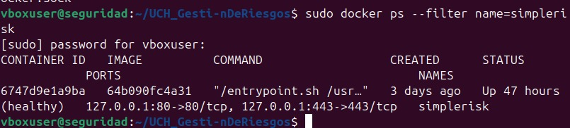
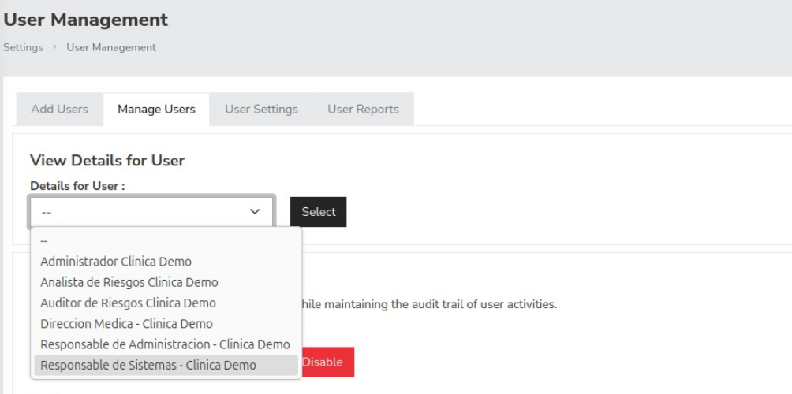
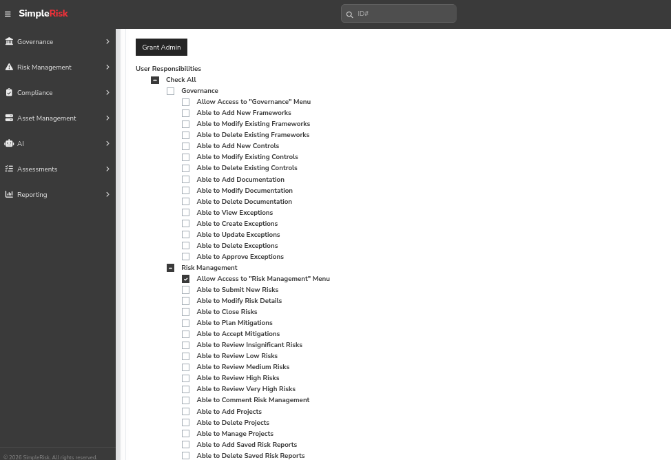
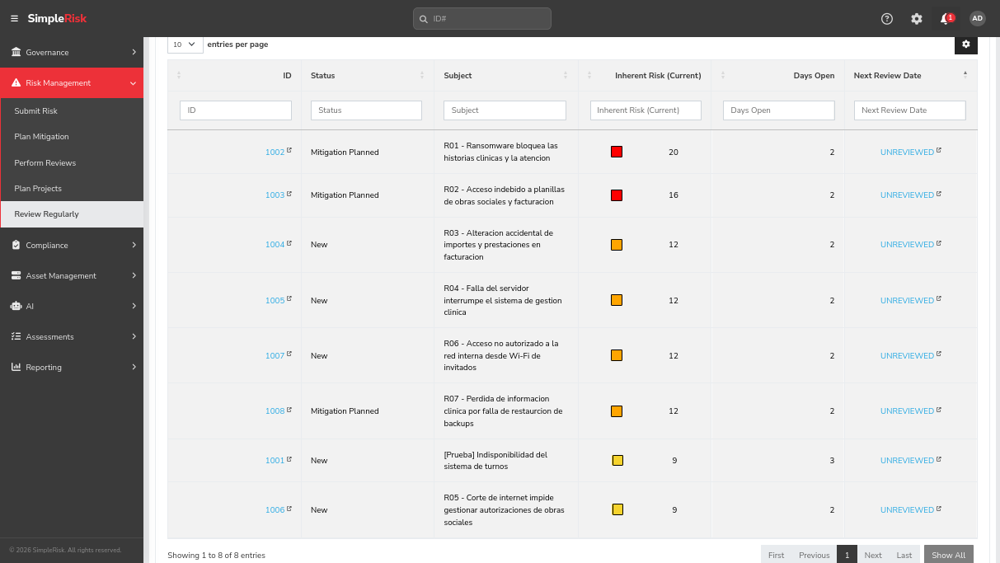
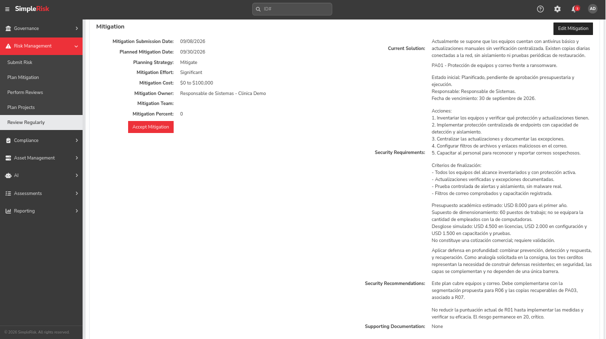
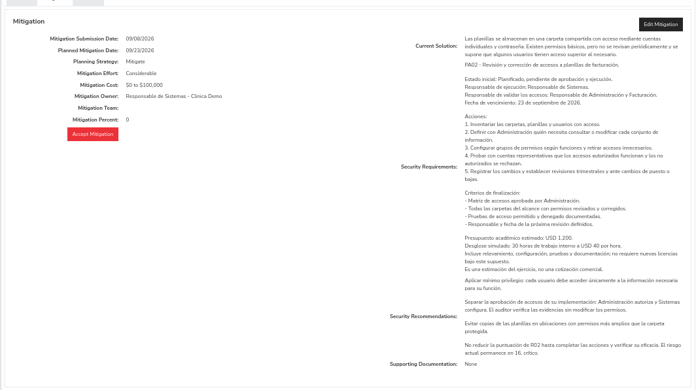
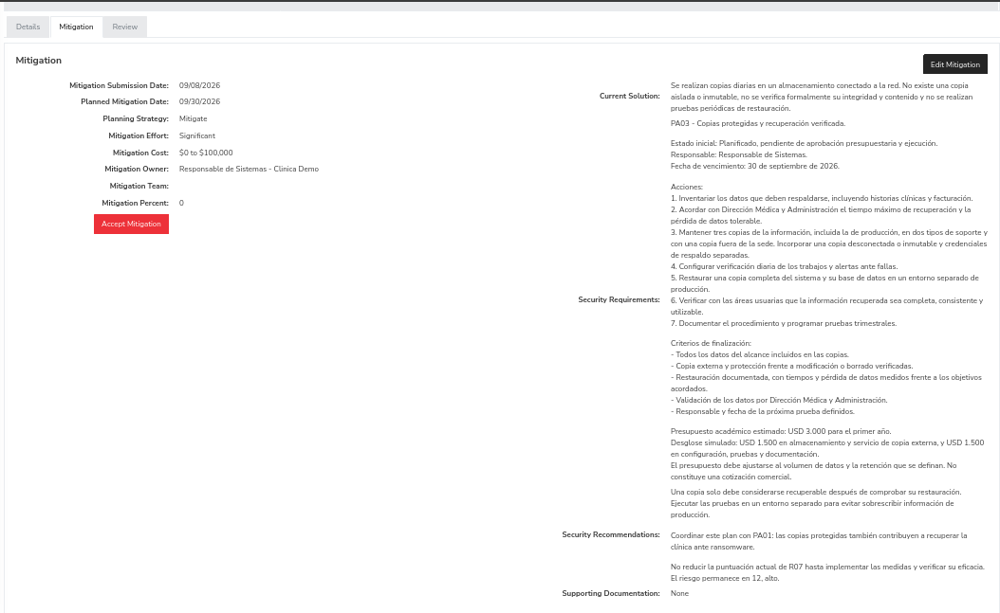

# Informe de gestión de riesgos con SimpleRisk

**Estudiante:** Valentino Farrando  
**Legajo:** 31782371  
**Caso:** Clínica Demo — escenario académico ficticio

## 1. Objetivo y alcance

Implementar un entorno de SimpleRisk y utilizarlo para identificar,
evaluar y planificar el tratamiento de riesgos de seguridad
de la información.

El caso representa una clínica privada con 120 empleados
y 800 pacientes diarios. Incluye historias clínicas, gestión
asistencial, conectividad y datos de obras sociales y facturación.

Los activos, las debilidades y los controles descritos son supuestos
académicos. No se utilizan datos reales de pacientes ni se presentan
los resultados como una auditoría de una clínica real.

## 2. Entorno de instalación

Se utilizó una máquina virtual Ubuntu 24.04 LTS en VirtualBox,
con 2 CPU virtuales y aproximadamente 5 GB de memoria RAM.

SimpleRisk se ejecuta mediante Docker Compose.
La imagen está fijada mediante su identificador SHA-256
en el archivo de configuración.

Los puertos HTTP y HTTPS están publicados únicamente
en la dirección de loopback 127.0.0.1 de la máquina virtual.
El acceso utilizado en la práctica es https://localhost.

Se definieron volúmenes para conservar la base de datos,
la aplicación, las configuraciones, los certificados,
los registros y los archivos de contraseñas del contenedor.
El contenido de esos volúmenes no se incluye en Git.

Durante la comprobación, Docker informó que el contenedor
simplerisk estaba en ejecución y con estado healthy.
Esto acredita el resultado de su comprobación de salud,
no una auditoría completa de seguridad.

- [Configuración Docker Compose](../entorno/docker-compose.yml)
- [Instrucciones generales de reproducción](../README.md)

### Consideraciones de reproducción

Levantar el contenedor no carga automáticamente los usuarios,
los activos, los riesgos ni los planes del ejercicio.

Estos registros se crean manualmente utilizando los documentos
de configuración de esta entrega.

Las operaciones de Docker se ejecutaron con sudo.
El certificado local requiere una excepción del navegador
durante esta práctica.

## 3. Usuarios y separación de responsabilidades

Se crearon seis cuentas:

- Administrador.
- Analista de riesgos.
- Auditor de consulta.
- Dirección Médica.
- Responsable de Administración.
- Responsable de Sistemas.

Se diferenciaron los permisos administrativos, de análisis
y de consulta. Para las cuentas no administrativas se asignaron
responsabilidades individuales en SimpleRisk.

Los propietarios de riesgos representan responsabilidades
organizacionales. La asignación como propietario no concede
automáticamente permisos adicionales sobre la aplicación.

[Detalle de usuarios y permisos](../configuracion/usuarios.md)

### Verificación del auditor

El auditor pudo consultar el listado y el detalle del riesgo
de prueba ID 1001.

Aunque se mostró un formulario para modificar la puntuación,
el intento de guardar el cambio fue rechazado por falta de permisos.

Esta comprobación se limita a la operación ensayada.
No demuestra que se hayan probado todos los controles de acceso.

La imagen documenta los permisos configurados.
El rechazo de la modificación se describe como resultado
de la prueba manual realizada.

## 4. Inventario de activos

Se registraron siete activos:

| ID | Activo |
|---|---|
| A01 | Historias clínicas digitales |
| A02 | Sistema de gestión clínica |
| A03 | Servidor de gestión clínica |
| A04 | Copias de seguridad |
| A05 | Red y conectividad |
| A06 | Equipos de médicos y administrativos |
| A07 | Datos de obras sociales y facturación |

[Inventario, clasificación y justificación](../configuracion/activos.md)

El rango obligatorio de Asset Valuation se utilizó como
valor provisional de carga, no como tasación ni como base
para calcular las puntuaciones de riesgo.

### Evidencias de los activos

- [A01 — Historias clínicas](capturas/02-activo-A01.png)
- [A02 — Sistema de gestión clínica](capturas/03-activo-A02.png)
- [A03 — Servidor](capturas/04-activo-A03.png)
- [A04 — Copias de seguridad](capturas/05-activo-A04.png)
- [A05 — Red y conectividad](capturas/06-activo-A05.png)
- [A06 — Equipos del personal](capturas/07-activo-A06.png)
- [A07 — Obras sociales y facturación](capturas/08-activo-A07.png)

## 5. Método de evaluación

Se configuró el método Classic con la fórmula:

Riesgo = Probabilidad × Impacto

Se utilizaron valores de 1 a 5 para ambas variables,
sin normalización a la escala 0–10.

| Puntuación | Nivel | Color |
|---|---|---|
| 1–4 | Bajo | Verde |
| 5–9 | Medio | Amarillo |
| 10–15 | Alto | Naranja |
| 16–25 | Crítico | Rojo |

El nivel Very High de SimpleRisk se interpreta como Crítico
en los documentos de la entrega.

La probabilidad se estimó cualitativamente para un horizonte
de 12 meses. Los valores representan juicios fundamentados
en los supuestos del caso, no frecuencias estadísticas medidas.

El producto de las escalas permite ordenar prioridades,
pero no equivale a una pérdida monetaria esperada.

## 6. Resultados de la evaluación

| Riesgo | ID en SimpleRisk | Probabilidad | Impacto | Puntuación | Nivel |
|---|---|---|---|---|---|
| R01 — Ransomware | 1002 | 4 | 5 | 20 | Crítico |
| R02 — Acceso indebido a facturación | 1003 | 4 | 4 | 16 | Crítico |
| R03 — Alteración accidental de facturación | 1004 | 3 | 4 | 12 | Alto |
| R04 — Falla del servidor | 1005 | 3 | 4 | 12 | Alto |
| R05 — Corte de Internet | 1006 | 3 | 3 | 9 | Medio |
| R06 — Acceso desde Wi-Fi de invitados | 1007 | 3 | 4 | 12 | Alto |
| R07 — Falla de restauración de respaldos | 1008 | 3 | 4 | 12 | Alto |

[Escenarios, justificaciones, controles y propietarios](../configuracion/riesgos.md)

El registro ID 1001 corresponde a una prueba de instalación
y permisos. Se muestra en la aplicación, pero se excluye
del análisis definitivo.

### Distribución

| Nivel | Cantidad | Porcentaje aproximado |
|---|---|---|
| Crítico | 2 | 28,6 % |
| Alto | 4 | 57,1 % |
| Medio | 1 | 14,3 % |
| Bajo | 0 | 0 % |
| Total | 7 | 100 % |

Seis de los siete riesgos son altos o críticos.
Esto fundamenta priorizar medidas de protección,
control de acceso y recuperación.

## 7. Planes de tratamiento

Se registraron tres planes con estrategia Mitigate.

| Plan | Riesgo | Responsable de ejecución | Vencimiento | Estimación |
|---|---|---|---|---|
| PA01 — Protección de equipos y correo | R01 | Responsable de Sistemas | 2026-09-30 | USD 8.000 |
| PA02 — Control de acceso a facturación | R02 | Responsable de Sistemas | 2026-09-23 | USD 1.200 |
| PA03 — Respaldos recuperables | R07 | Responsable de Sistemas | 2026-09-30 | USD 3.000 |

Presupuesto académico total estimado: USD 12.200.

Los importes son simulados y requieren validación.
Los planes están pendientes de aprobación y ejecución.

[Acciones, presupuestos y criterios de finalización](../configuracion/planes.md)

### Criterio de selección

PA01 y PA02 atienden los dos riesgos críticos.

PA03 se selecciona entre los riesgos altos por su contribución
a recuperar información y por su complementariedad con PA01.
La prioridad de recuperación no elimina la necesidad
de prevenir el compromiso de los sistemas.

Los otros cuatro riesgos tienen estrategias propuestas,
pero no planes detallados registrados en esta etapa.
Esto no implica su aceptación.

### Evidencias

## 8. Riesgo actual y seguimiento

Mitigation Percent permanece en 0 para los tres planes.
No se atribuye reducción de riesgo a medidas que todavía
no se implementaron ni se comprobaron.

Las puntuaciones actuales permanecen en sus valores iniciales.
La aplicación muestra los tres riesgos tratados como
Mitigation Planned; ese estado significa que existe un plan,
no que se haya completado.

La evaluación residual objetivo deberá distinguirse
de la evaluación residual verificada.

Después de ejecutar las acciones, se deberán revisar:

- Resultados de las pruebas y evidencias.
- Cobertura de las medidas.
- Desvíos de plazo y presupuesto.
- Probabilidad e impacto actualizados.
- Decisión del propietario sobre el riesgo restante.

## 9. Limitaciones

- El caso utiliza supuestos académicos.
- No se dispone de estadísticas de incidentes de una clínica real.
- No se implementaron las medidas de los planes.
- Los presupuestos no son cotizaciones.
- No se ejecutaron ataques ni se utilizó malware real.
- Las pruebas de permisos se limitaron a las operaciones descritas.
- Las capturas acreditan configuraciones y estados observados,
  no la eficacia futura de los tratamientos.

## 10. Conclusión de las partes A y B

Se implementó SimpleRisk, se configuraron usuarios con permisos
diferenciados y se registraron siete activos y siete riesgos.

La evaluación identificó dos riesgos críticos, cuatro altos
y uno medio. Se documentaron tres planes con responsables,
fechas, presupuestos y criterios de finalización.

La siguiente etapa de gestión consiste en aprobar los planes,
ejecutar las acciones y verificar sus resultados antes
de reducir las puntuaciones de riesgo.

## 11. Parte C — Comparación con NIST SP 800-30

### 11.1. Metodología alternativa

NIST SP 800-30 Rev. 1 es una guía para realizar evaluaciones
de riesgos. Contempla preparar la evaluación, realizarla,
comunicar los resultados y mantenerla actualizada.

Considera amenazas, vulnerabilidades, condiciones predisponentes,
probabilidad e impacto. Su finalidad es aportar información
para tomar decisiones sobre los riesgos.

Fuente: [NIST SP 800-30 Rev. 1](https://csrc.nist.gov/pubs/sp/800/30/r1/final).

### 11.2. Comparación

SimpleRisk es la herramienta utilizada para registrar y gestionar
el caso. La comparación corresponde al método Classic configurado
en esta práctica, no a todas las capacidades de SimpleRisk.

| Aspecto | Método utilizado en la práctica | NIST SP 800-30 |
|---|---|---|
| Enfoque | Puntuación mediante probabilidad e impacto de 1 a 5 | Proceso estructurado de evaluación de riesgos |
| Amenazas y vulnerabilidades | Descritas en cada escenario | Factores explícitos del análisis |
| Resultado | Puntuación de 1 a 25 y prioridad | Evaluación fundamentada para apoyar decisiones |
| Incertidumbre | Se declaran supuestos y falta de estadísticas | Se contempla al documentar y comunicar la evaluación |
| Actualización | Se propone revisar después del tratamiento | El mantenimiento de la evaluación forma parte del proceso |

NIST no exige utilizar nuestra fórmula exacta de multiplicación
ni los umbrales de colores elegidos para este trabajo.

Fuente: [Guía completa de NIST](https://nvlpubs.nist.gov/nistpubs/Legacy/SP/nistspecialpublication800-30r1.pdf).

### 11.3. Aplicación propuesta a R01

Como adaptación al caso académico, se propone ampliar
la evaluación de ransomware de la siguiente manera:

| Elemento | Aplicación al caso |
|---|---|
| Alcance | Equipos del personal, sistema clínico, servidor y respaldos |
| Fuente de amenaza | Actor externo que distribuye software malicioso |
| Evento | Un correo provoca el compromiso de un equipo y el cifrado de información |
| Debilidades supuestas | Actualizaciones manuales, protección limitada y respaldos accesibles desde la red |
| Consecuencias | Interrupción de la atención y dificultad para recuperar historias clínicas |
| Evidencia necesaria | Inventario, estado de actualizaciones, configuración de protección y resultados de restauración |
| Incertidumbre | No existen estadísticas ni pruebas técnicas suficientes para confirmar la eficacia de los controles |

Las valoraciones actuales de probabilidad 4 e impacto 5
se mantienen como estimaciones académicas.

Antes de modificarlas se propone reunir evidencia sobre
la cobertura de protección, las actualizaciones y la recuperación.
La adopción de otra metodología no reduce por sí sola el riesgo.

### 11.4. Ventajas, limitaciones y elección

Para esta clínica ficticia, el método utilizado permite presentar
prioridades de manera sencilla y registrar responsables y planes.

Como limitación, una misma puntuación puede representar escenarios
diferentes. Además, multiplicar escalas ordinales no produce
una estimación de pérdida económica.

La adaptación de NIST aportaría mayor disciplina al justificar
los escenarios, identificar evidencia faltante y revisar supuestos.
Su aplicación requeriría más tiempo de análisis y participación
de las áreas clínica, administrativa y técnica.

Se propone conservar SimpleRisk como registro de gestión
y utilizar NIST como guía para profundizar las evaluaciones.
Esta propuesta no constituye una implementación completa
ni una certificación de cumplimiento con NIST.

## 12. Parte C — Propuesta de integración con GitHub Issues

### 12.1. Objetivo y alcance

Se propone vincular los planes de SimpleRisk con tickets
de GitHub Issues para seguir su ejecución.

SimpleRisk conservaría las evaluaciones, los propietarios
y las decisiones sobre el riesgo.
GitHub Issues permitiría organizar las tareas y sus evidencias.

GitHub admite responsables, etiquetas y comentarios en los issues.
También permite agruparlos mediante milestones, que pueden
tener fecha de vencimiento.

Fuentes:
- [GitHub Issues](https://docs.github.com/en/issues/tracking-your-work-with-issues/learning-about-issues/about-issues).
- [Milestones](https://docs.github.com/en/issues/using-labels-and-milestones-to-track-work/about-milestones).

La integración se presenta como diseño: no se crearon tickets
ni se implementó sincronización en esta práctica.

### 12.2. Correspondencia propuesta

| SimpleRisk | Registro propuesto en GitHub |
|---|---|
| Identificador del riesgo | Referencia en el cuerpo del issue |
| Identificador y título del plan | Título del issue |
| Responsable de ejecución | Cuenta autorizada asignada al issue |
| Fecha prevista | Fecha en el cuerpo y milestone correspondiente |
| Acciones | Lista de tareas |
| Criterios de finalización | Lista de comprobaciones y evidencia requerida |
| Estado de ejecución | Etiqueta y comentarios de seguimiento |
| Referencia al ticket | URL registrada en las notas del plan |

Las cuentas locales de SimpleRisk no son cuentas de GitHub.
La asignación requeriría acordar qué cuenta real representa
a cada responsable.

### 12.3. Tickets propuestos

| Título | Riesgo | Fecha prevista | Estado inicial |
|---|---|---|---|
| PA01 - Protección de equipos y correo frente a ransomware | R01 / 1002 | 2026-09-30 | Pendiente de aprobación |
| PA02 - Control de acceso a facturación | R02 / 1003 | 2026-09-23 | Pendiente de aprobación |
| PA03 - Respaldos recuperables y pruebas de restauración | R07 / 1008 | 2026-09-30 | Pendiente de aprobación |

Estos títulos son ejemplos de diseño.
No corresponden a tickets efectivamente creados.

### 12.4. Flujo de trabajo propuesto

1. Registrar y revisar el plan en SimpleRisk.
2. Crear el issue con su identificador, acciones, responsable,
   presupuesto y fecha prevista.
3. Registrar la URL del issue en las notas del plan.
4. Actualizar el seguimiento mediante comentarios y evidencias.
5. Pasar el ticket a pendiente de verificación cuando las acciones
   estén realizadas.
6. Verificar los criterios de finalización antes de cerrarlo.
7. Revisar por separado la evaluación del riesgo en SimpleRisk.

Los estados de trabajo se representarían mediante etiquetas:
pendiente de aprobación, en ejecución y pendiente de verificación.
El cierre del issue se reservaría para la finalización validada.

Cerrar un ticket no implica aceptar el riesgo restante
ni reducir automáticamente su puntuación.

### 12.5. Implementación inicial y posible evolución

La primera etapa sería una vinculación manual mediante
identificadores y referencias cruzadas. Esto permite probar
el flujo sin desarrollar un conector.

Como evolución futura, se podría evaluar una automatización
mediante APIs, después de comprobar las funciones y permisos
disponibles en la instalación de SimpleRisk.

El diseño de esa automatización debería contemplar:

- Evitar duplicados utilizando el identificador único del plan.
- Definir qué sistema es responsable de cada campo.
- Registrar errores y permitir reintentos controlados.
- Mantener las credenciales fuera del repositorio.
- Reservar la aprobación y la reevaluación del riesgo
  a una revisión humana.

No se afirma que exista una integración nativa habilitada
en el entorno utilizado.

### 12.6. Seguridad y organización

En una implementación real se utilizaría un repositorio privado
autorizado, con acceso limitado a los responsables.

No se incluirían historias clínicas, contraseñas, tokens
ni detalles operativos sensibles en los tickets.

Los issues pertenecen al repositorio, no a una rama individual.
Por eso no se crearían tickets en el repositorio compartido
de la materia sin acordarlo con su administrador.

### 12.7. Criterios de validación de la propuesta

Si se implementara, se comprobaría que:

- Cada plan tiene un único ticket asociado.
- Las referencias permiten identificar el riesgo y el plan.
- El responsable y la fecha coinciden en ambos sistemas.
- El cierre requiere evidencia de finalización.
- La puntuación del riesgo no cambia automáticamente.
- Los usuarios no autorizados no acceden a información restringida.

### 12.8. Beneficio esperado

La vinculación permitiría separar el seguimiento de tareas
de la evaluación del riesgo y facilitaría comprobar
qué acciones están pendientes y quién debe realizarlas.

Su utilidad dependería de mantener actualizados ambos registros
y verificar las evidencias antes de considerar terminado un plan.

## 13. Alcance final

La parte C se desarrolla como comparación metodológica
y propuesta de integración.
