# Informe Técnico — Gestión de Riesgos en Entornos de Salud

* **Estudiante:** Tomas Serrani
* **LU:** 31954584
* **Materia:** Seguridad
* **Escenario:** Clínica Médica Privada (120 empleados, ~800 pacientes/día, Historias Clínicas Digitales)

---

## 1. Despliegue e Infraestructura del Entorno

Para la realización del Trabajo Práctico se desplegó la herramienta GRC **SimpleRisk** haciendo uso de contenedores mediante **Docker Compose**. Esta arquitectura garantiza la reproductibilidad del entorno y el aislamiento de componentes.

### Componentes del Entorno
* **Motor GRC:** SimpleRisk (vía imagen oficial `simplerisk/simplerisk:latest`).
* **Mapeo de Puertos:** Mapeo desde el puerto de la aplicación al puerto del host (`8080:80`).
* **Persistencia:** Almacenamiento persistente mediante volúmenes en Docker Compose.

### Verificación de Servicios
El estado de ejecución del contenedor fue verificado a través de la terminal mediante el comando `docker compose ps`:

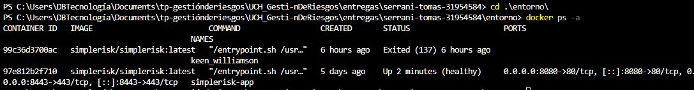

---

## 2. Gestión de Usuarios y Control de Acceso (RBAC)

Se configuraron tres perfiles diferenciados en SimpleRisk aplicando el principio de **menor privilegio** (Least Privilege) y la **separación de funciones** (Segregation of Duties):

1. **`admin_sys` (Administrador de Sistemas - Tomas Serrani):** Control total sobre los parámetros de configuración, administración de usuarios y opciones globales de la plataforma.
2. **`analyst_sec` (Analista de Riesgos - Maria Gomez):** Responsable de la identificación, evaluación, carga de riesgos y propuesta de mitigaciones.
3. **`auditor_ext` (Auditor Externo - Carlos Lopez):** Perfil con permisos de solo lectura para la revisión e inspección de controles y registros sin capacidad de edición.

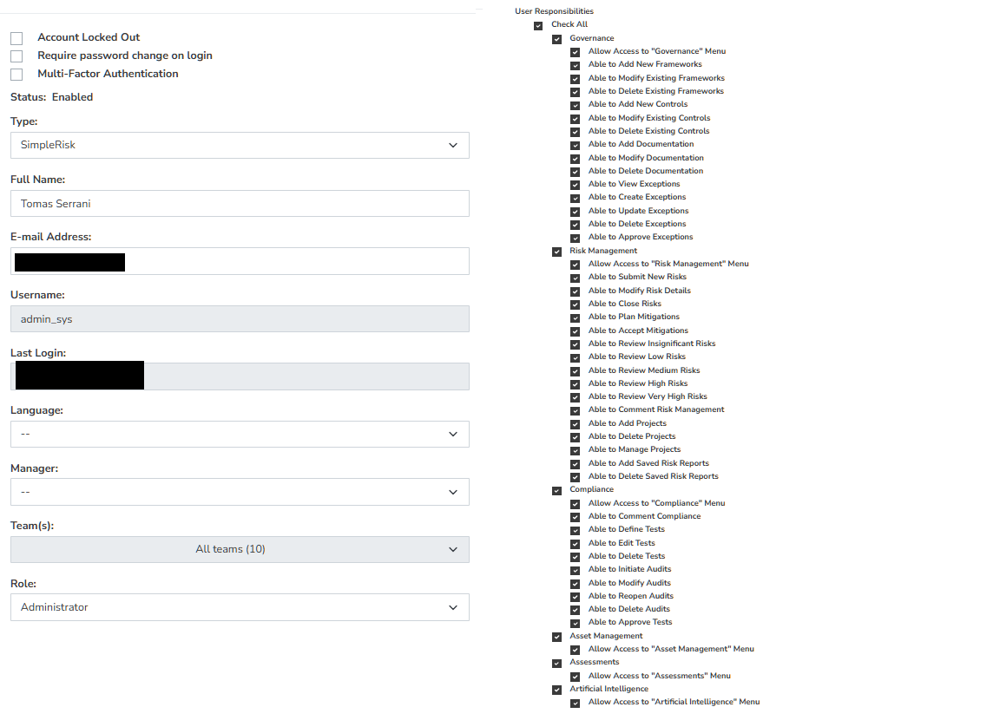 
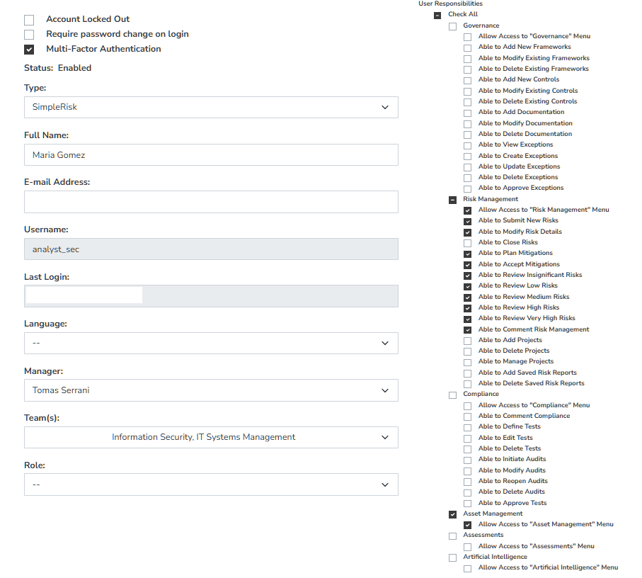 
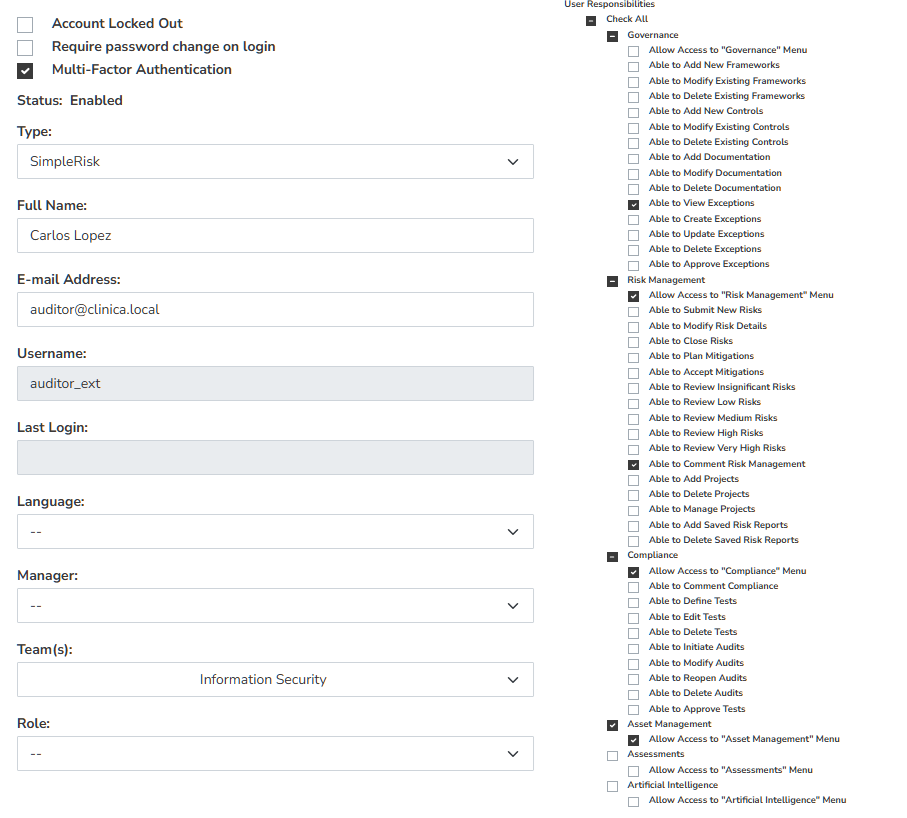

---

## 3. Identificación y Evaluación de Riesgos (Entorno Clínico)

Considerando la operatividad de la clínica (atención diaria de 800 pacientes y procesamiento de Historias Clínicas Digitales - HCD), se evaluaron 7 riesgos utilizando una matriz cualitativa $5 \times 5$ (Escalas 1-5 de Probabilidad e Impacto):

| ID | Riesgo Identificado | Probabilidad | Impacto | Nivel de Riesgo 
| :--- | :--- | :---: | :---: | :---: |
| **R01** | Ransomware en Servidor de Historias Clínicas Digitales (HCD) | Probable (4) | Catastrófico (5) | **Crítico (20)** |
| **R02** | Phishing a personal de facturación para robo de credenciales | Probable (4) | Mayor (4) | **Crítico (16)** |
| **R03** | Acceso no autorizado a HCD por ausencia de MFA | Posible (3) | Catastrófico (5) | **Alto (15)** |
| **R04** | Caída del sistema por corte eléctrico sin soporte de UPS | Posible (3) | Mayor (4) | **Alto (12)** |
| **R05** | Fallas en la restauración de copias de seguridad (Backups) | Posible (3) | Mayor (4) | **Alto (12)** |
| **R06** | Fuga de datos y sanciones por incumplimiento de LPDP | Raro (2) | Catastrófico (5) | **Alto (10)** |
| **R07** | Alteración de recetas electrónicas por falta de firma digital | Posible (3) | Moderado (3) | **Medio (9)** |

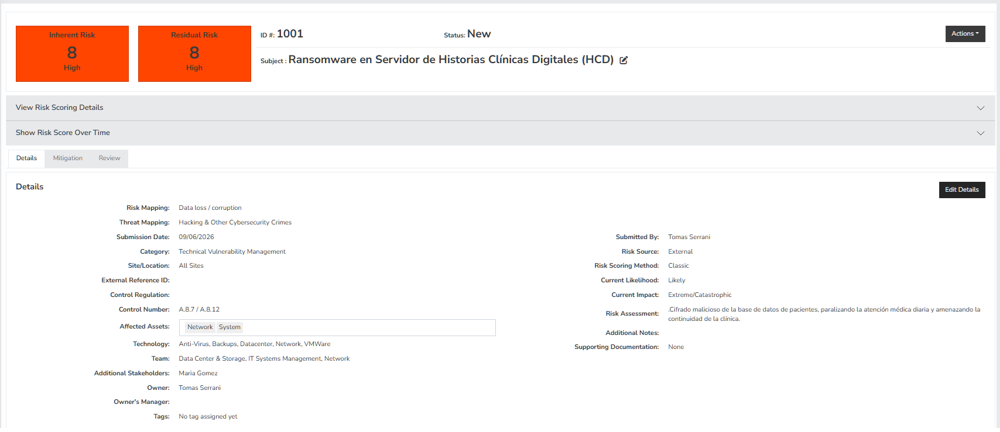
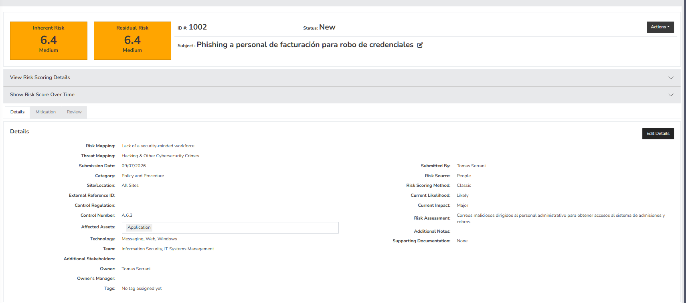
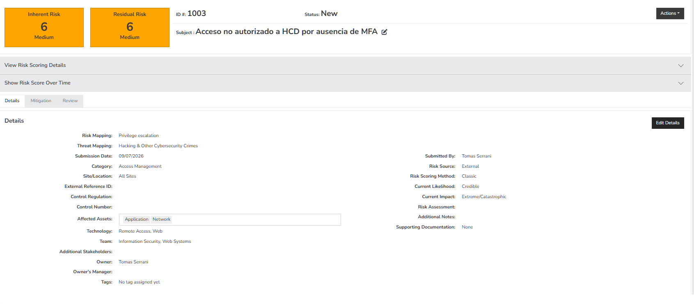
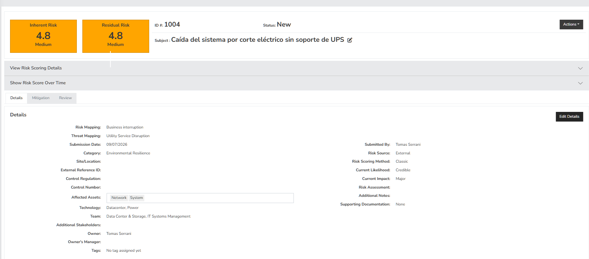
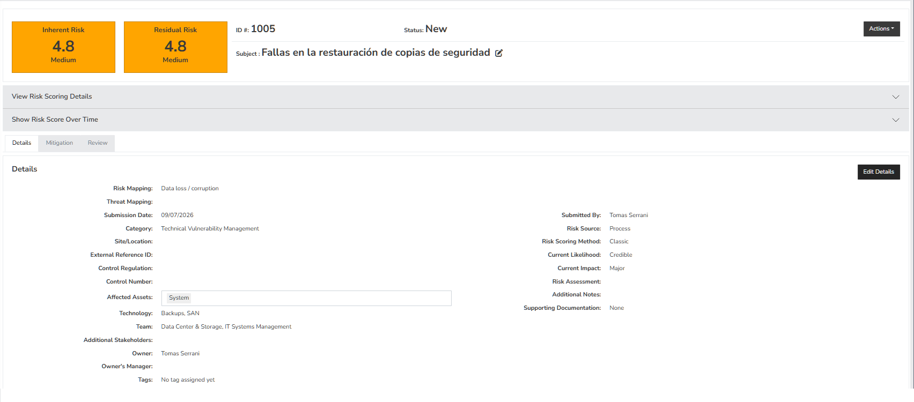
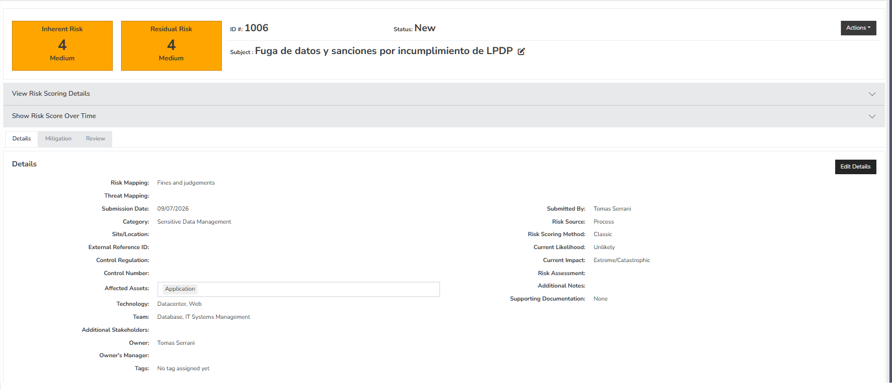
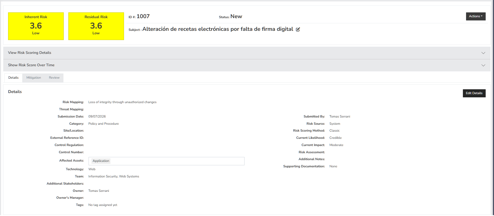
---

## 4. Definición de Planes de Acción (Mitigación)

Para los riesgos catalogados como **Críticos** y **Altos**, se formalizaron planes de tratamiento en el módulo *Mitigation*:

* **PA-01 (Asociado a R01): Despliegue de EDR y Copias Inmutables (WORM)**
  * *Estrategia:* Mitigar.
  * *Detalle:* Instalación de agentes de detección en servidores y almacenamiento de copias de seguridad fuera de línea.
  * *Responsable:* Director de IT | *Plazo:* 30 días | *Presupuesto:* USD 4,500.

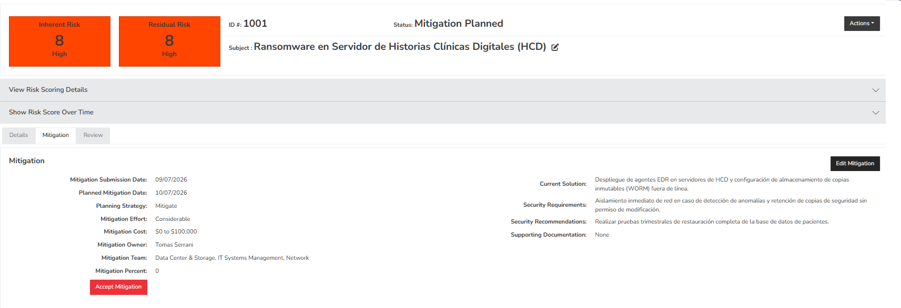

* **PA-02 (Asociado a R02 y R03): Autenticación Multifactor (MFA) Obligatoria**
  * *Estrategia:* Mitigar.
  * *Detalle:* Requerir MFA en el portal de acceso web, VPN y correo corporativo.
  * *Responsable:* CISO / Resp. de Seguridad | *Plazo:* 15 días | *Presupuesto:* USD 1,200.

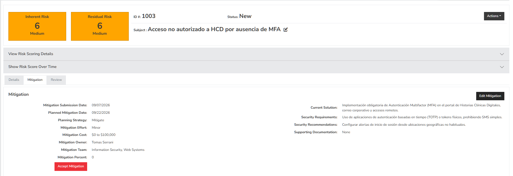

* **PA-03 (Asociado a R02): Capacitación y Simulaciones de Phishing**
  * *Estrategia:* Mitigar.
  * *Detalle:* Programa de concienciación obligatorio para el personal administrativo y asistencial.
  * *Responsable:* Resp. de Seguridad | *Plazo:* 45 días | *Presupuesto:* USD 800.

  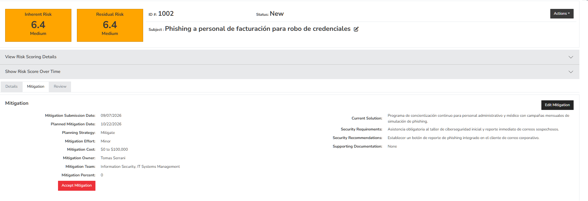

---

## 5. Análisis Comparativo Metodológico y Monitoreo

### SimpleRisk (Matriz Qualitative $5 \times 5$) vs. Metodología FAIR

| Aspecto | SimpleRisk (Matriz $5 \times 5$) | Metodología FAIR (Quantitative) |
| :--- | :--- | :--- |
| **Tipo de Análisis** | Cualitativo / Semicuantitativo. | Cuantitativo probabilístico (Monte Carlo). |
| **Resultado/Métrica** | Categorías discretas (Bajo, Medio, Alto, Crítico). | Pérdida financiera estimada en dinero (USD / \$). |
| **Ventajas** | Rápida implementación, fácil comprensión. | Elimina la subjetividad, facilita cálculo de ROI. |
| **Desventajas** | Subjetividad en las apreciaciones de impacto. | Requiere datos históricos detallados. |
| **Caso de Uso** | Operaciones diarias de IT y priorización rápida. | Decisiones de inversión ante el Directorio / Board. |

### Integración Externa y Monitoreo
SimpleRisk soporta la integración mediante **Webhooks HTTP**. En un esquema de producción, los eventos correspondientes a riesgos con nivel mayor o igual a "Alto" se pueden configurar para enviar alertas automáticas en formato JSON a plataformas como Slack, Microsoft Teams o un sistema SIEM (como Wazuh o Elastic), habilitando respuestas inmediatas del equipo SOC.

---

## 6. Verificación y Checklist de Auto-Revisión

Palabra clave de verificación de lectura: **girasol**

- [x] No hay credenciales en el repositorio
- [x] El `.gitignore` está correctamente configurado
- [x] Las capturas no muestran datos sensibles
- [x] Los archivos `.sql` o dumps no están subidos
- [x] El informe está en formato legible
- [x] El reporte ejecutivo está completo
- [x] Los mensajes de commit son descriptivos
- [x] Mi branch está actualizada y funciona