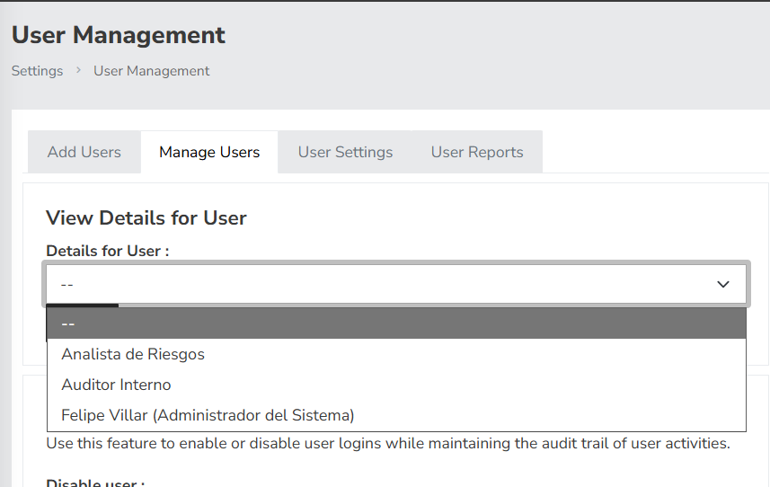
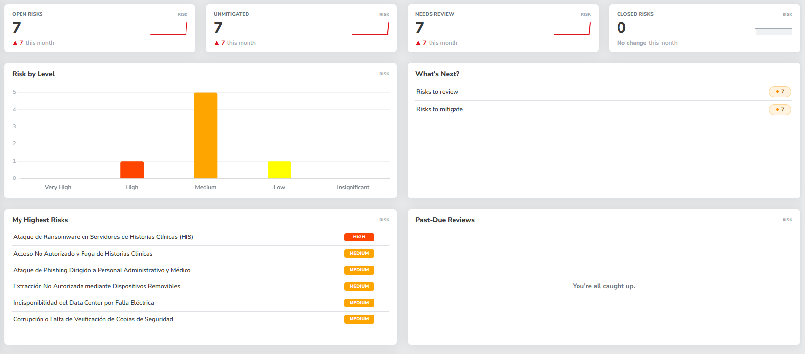
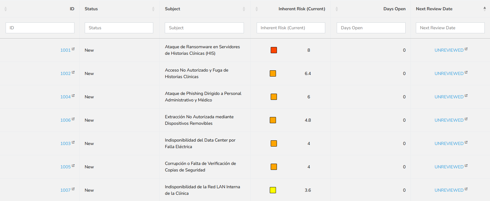
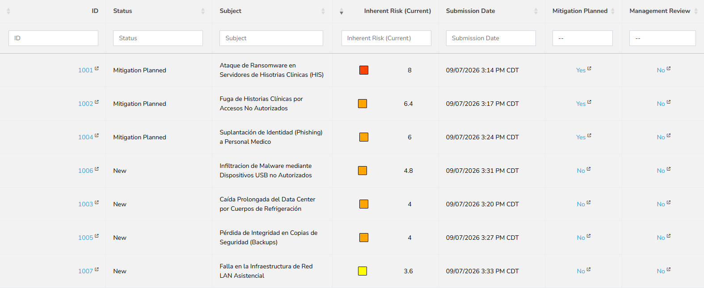
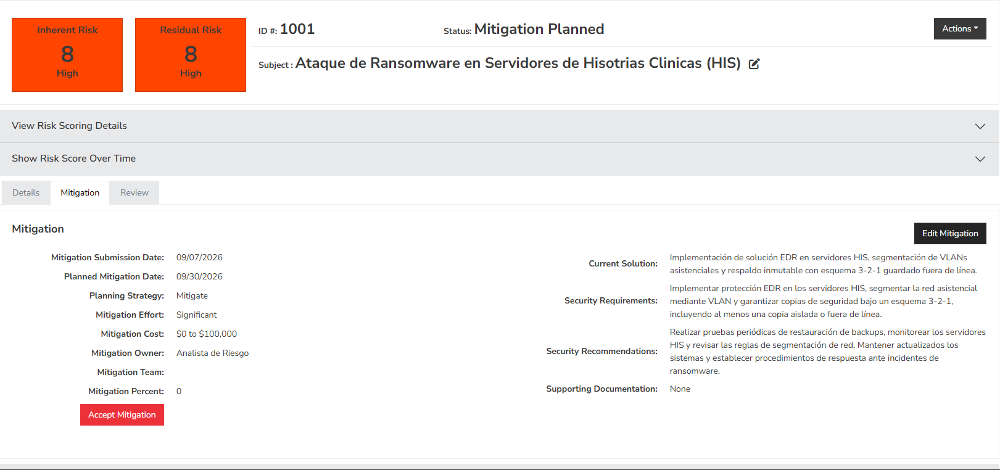
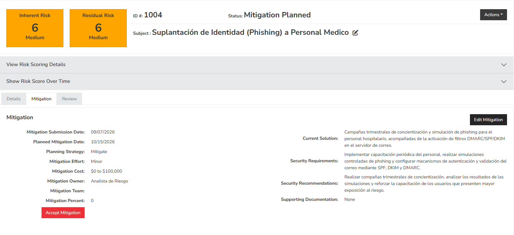
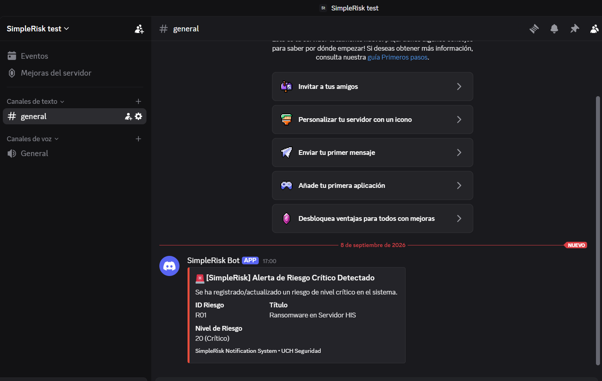

# Informe Técnico — Gestión de Riesgos con SimpleRisk

## Datos del trabajo

- **Alumno:** Felipe Villar Zuloaga
- **LU:** 31065066
- **Correo institucional:** villarfelipe@uch.edu.ar
- **Materia:** Seguridad de Sistemas
- **Comisión:** G
- **Organización analizada:** Clínica Médica Privada
- **Carácter del escenario:** Ficticio y de uso académico

## 1. Análisis del entorno

### 1.1 Descripción de la organización

La organización analizada es una clínica privada ficticia de aproximadamente 120 empleados y unas 800 atenciones diarias. Debido al volumen de atención, la disponibilidad de los sistemas informáticos es un aspecto importante para la continuidad de las actividades asistenciales.

Los principales sistemas son el HIS y las Historias Clínicas Digitales. El entorno considerado también comprende servidores, estaciones de trabajo, infraestructura de red, copias de seguridad y correo institucional. Estos componentes se encuentran relacionados: una falla o incidente sobre alguno de ellos puede afectar el acceso a la información clínica o la prestación normal de los servicios.

La información manejada por la clínica requiere especial cuidado por su carácter sensible. Por este motivo, el análisis considera riesgos que pueden afectar la confidencialidad, integridad y disponibilidad de los sistemas y de la información.

### 1.2 Modelo de madurez

Para este trabajo se considera que la clínica posee una madurez de seguridad intermedia. Cuenta con algunos controles básicos, pero todavía presenta oportunidades de mejora en aspectos como MFA, protección contra ransomware, segmentación de red, backups, monitoreo, capacitación, control de accesos y recuperación.

Esta situación es coherente con una organización que ya utiliza sistemas informáticos críticos y posee controles iniciales, pero necesita fortalecerlos de manera planificada y coordinada.

### 1.3 Alcance

El alcance comprende los activos relacionados con la operación de los sistemas de información de la clínica: HIS, Historias Clínicas Digitales, servidores, estaciones de trabajo, red LAN asistencial, infraestructura de respaldo y correo institucional.

El análisis no utiliza datos de pacientes reales ni bases de datos reales. El escenario y la información presentada son exclusivamente académicos.

## 2. Configuración del entorno y gestión en SimpleRisk

### 2.1 Usuarios y roles

Se configuraron tres usuarios con roles diferenciados aplicando el principio de mínimo privilegio para separar las tareas de administración, gestión y revisión.

### 2.2 Dashboard general

El panel principal permite visualizar el estado general de los riesgos registrados y su distribución dentro de la plataforma.

### 2.3 Identificación y evaluación de riesgos

Se utilizaron escalas del 1 al 5 para probabilidad e impacto en una matriz cualitativa de 5 × 5. Los valores documentados son los observados en SimpleRisk.

#### Probabilidad

| Valor | Descripción |
|---:|---|
| 1 | Muy baja |
| 2 | Baja |
| 3 | Media |
| 4 | Alta |
| 5 | Muy alta |

#### Impacto

| Valor | Descripción |
|---:|---|
| 1 | Muy bajo |
| 2 | Bajo |
| 3 | Medio |
| 4 | Alto |
| 5 | Muy alto |

#### Tabla de riesgos identificados

| ID | Nombre | Categoría | Prob. | Impacto | Valor observado | Tratamiento | Estado |
|---|---|---|---:|---:|---:|---|---|
| R01 | Ataque de Ransomware en Servidores de Historias Clínicas (HIS) | Technical Vulnerability Management | 4 | 5 | 8.0 | Mitigate | Mitigation Planned |
| R02 | Fuga de Historias Clínicas por Acceso No Autorizado | Sensitive Data Management | 4 | 4 | 6.4 | Mitigate | Mitigation Planned |
| R03 | Caída Prolongada del Data Center por Falla de Refrigeración | Environmental Resilience | 2 | 5 | 4.0 | Mitigate | New |
| R04 | Suplantación de Identidad (Phishing) a Personal Médico | Policy and Procedure | 5 | 3 | 6.0 | Mitigate | Mitigation Planned |
| R05 | Pérdida de Integridad en Copias de Seguridad (Backups) | Technical Vulnerability Management | 2 | 5 | 4.0 | Mitigate | New |
| R06 | Infiltración de Malware mediante Dispositivos USB no Autorizados | Physical Security | 3 | 4 | 4.8 | Mitigate | New |
| R07 | Falla en la Infraestructura de Red LAN Asistencial | Monitoring | 3 | 3 | 3.6 | Mitigate | New |

#### Estado inicial de los riesgos registrados
A continuación se observa la carga inicial de los 7 riesgos en SimpleRisk en su estado base ("New"):

#### Asignación y planificación de mitigaciones
Luego de definir los planes de acción para los riesgos de prioridad alta (R01, R02 y R04), la plataforma actualiza su estado a "Mitigation Planned":

### 2.4 Priorización

El ranking de los riesgos se realizó respetando los valores observados en SimpleRisk.

| Puesto | ID | Riesgo | Valor |
|---:|---|---|---:|
| 1 | R01 | Ransomware en servidores HIS | 8.0 |
| 2 | R02 | Acceso no autorizado a historias clínicas | 6.4 |
| 3 | R04 | Phishing al personal médico | 6.0 |
| 4 | R06 | Malware mediante dispositivos USB | 4.8 |
| 5 | R03 | Falla de refrigeración del Data Center | 4.0 |

### 2.5 Plan de acción R01 — Protección contra ransomware del HIS

El plan **Protección contra ransomware del HIS** corresponde al riesgo R01, cuyo tratamiento es **Mitigate**.

El responsable en SimpleRisk es el **Analista de Riesgo** y el responsable funcional es el **Responsable de Seguridad Informática**. La fecha planificada es el **30/09/2026** y el costo estimado es de **USD 25.000**.

La solución contempla la implementación de EDR en servidores HIS, segmentación de VLANs asistenciales y respaldo inmutable con esquema 3-2-1 guardado fuera de línea.

### 2.6 Plan de acción R02 — Protección de historias clínicas

El plan **Protección de historias clínicas** corresponde al riesgo R02 y utiliza la estrategia **Mitigate**.

El responsable en SimpleRisk es el **Analista de Riesgo** y el responsable funcional es el **Responsable de Sistemas**. La fecha planificada es el **15/10/2026**, con un costo estimado de **USD 15.000**.

La solución propuesta incluye una solución DLP, autenticación multifactor (MFA) obligatoria para el personal de salud y auditoría periódica de los logs de acceso a la base de datos HIS.

### 2.7 Plan de acción R04 — Programa de prevención de phishing

El plan **Programa de prevención de phishing** corresponde al riesgo R04 y utiliza la estrategia **Mitigate**.

El responsable en SimpleRisk es el **Analista de Riesgo** y el responsable funcional es el **Responsable de Seguridad Informática**. La fecha planificada es el **15/10/2026**, con un costo estimado de **USD 5.000**.

La solución contempla campañas trimestrales de concientización y simulación de phishing para el personal hospitalario, junto con la activación de filtros DMARC/SPF/DKIM en el servidor de correo.

### 2.8 Seguimiento

Los planes de mitigación comienzan con un **0 % de mitigación** porque se encuentran planificados. Este valor no debe interpretarse como que los controles ya fueron implementados ni como una medición de riesgo residual.

## 3. Actividad optativa D2 — Integración con Discord

Se implementó la automatización de notificaciones hacia Discord (Punto D2) mediante el script `scripts/notificar_discord.ps1`. 

El script en PowerShell envía alertas en tiempo real a través de un Webhook cuando se detecta un evento o riesgo crítico dentro de la plataforma. La dirección del Webhook se gestiona mediante la variable de entorno `DISCORD_WEBHOOK_URL` para garantizar la seguridad de las credenciales.

*Nota de seguridad:* Por motivos de seguridad y en cumplimiento con las pautas de la cátedra, el Webhook real, tokens y credenciales fueron excluidos del repositorio.