# Informe Técnico — Gestión de Riesgos en Entornos de Salud

* **Estudiante:** Gabriel Rodriguez Cid
* **Materia:** Seguridad
* **Escenario:** Clínica Médica Privada (120 empleados, ~800 pacientes/día, Historias Clínicas Digitales)

---

## 1. Despliegue e Infraestructura del Entorno

Para la realización del Trabajo Práctico se desplegó la herramienta GRC **SimpleRisk** haciendo uso de contenedores mediante **Docker** en **Kali Linux**. Esta arquitectura garantiza la reproductibilidad del entorno y el aislamiento de componentes.

### Componentes del Entorno
* **Motor GRC:** SimpleRisk (vía imagen oficial).
* **Mapeo de Puertos:** Mapeo desde el puerto de la aplicación al puerto del host (`8080:80`).
* **Persistencia:** Almacenamiento persistente mediante volúmenes en Docker.

### Verificación de Servicios
El estado de ejecución del contenedor y la interfaz inicial fueron verificados a través de la terminal y el navegador:

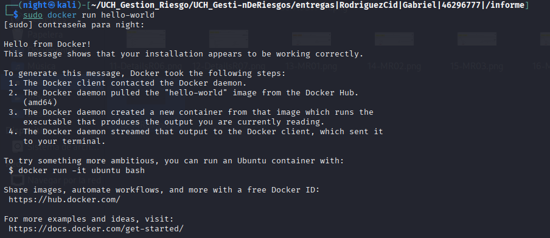

---

## 2. Gestión de Usuarios y Control de Acceso (RBAC)

Se configuraron tres perfiles diferenciados en SimpleRisk aplicando estrictamente el principio de **menor privilegio** (Least Privilege):

1. **`Night` (Administrador - Gabriel Rodriguez Cld):** Control total sobre los parámetros de configuración, administración de usuarios y opciones globales de la plataforma.
2. **`RSanalista` (Analista de Riesgos - Roberto Sanchez):** Responsable de la identificación, evaluación, carga de riesgos y propuesta de mitigaciones.
3. **`PerezAuditorCalidad` (Auditor - Pedro Perez):** Perfil orientado a la revisión de riesgos, auditoría y compliance sin capacidad de edición.

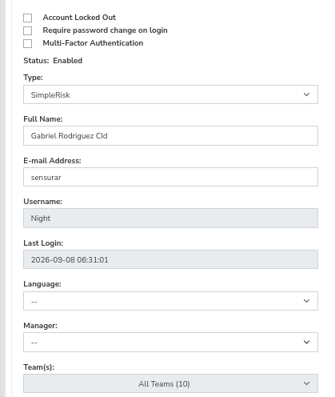
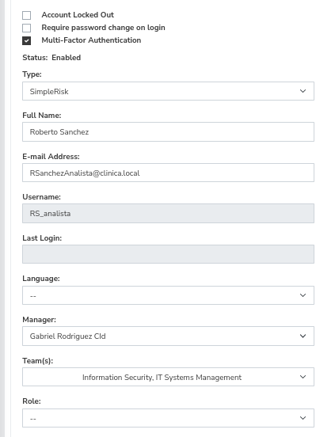
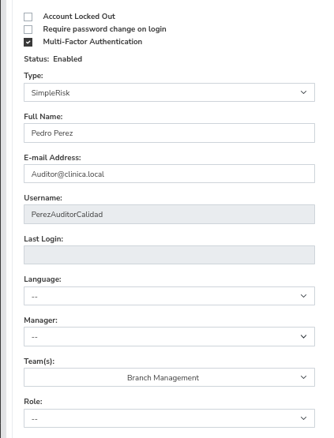

---

## 3. Identificación y Evaluación de Riesgos (Entorno Clínico)

A continuación se detallan los 7 riesgos registrados en la plataforma SimpleRisk en base al análisis de infraestructura y ciberseguridad de la clínica:

| ID | Riesgo / Sujeto | Activo Afectado | Probabilidad (Likelihood) | Impacto | Nivel (Inherent) | Propietario |
| :--- | :--- | :--- | :---: | :---: | :---: | :--- |
| **1001** | **R01 - Filtración de historias clínicas por falta de controles de acceso** | A01 - Base de Datos de Historias Clínicas | Credible (3) | Major (4) | **4.8 (Medium)** | Roberto Sanchez |
| **1002** | **R02 - Caída del servidor de turnos por fallo de infraestructura o saturación** | A02 - Servidor Web de Turnos | Unlikely (2) | Major (4) | **3.2 (Low)** | Gabriel Rodriguez Cld |
| **1003** | **R03 - Interrupción de la red troncal por fallas de conectividad o equipos obsoletos** | A03 - Red Interna y Equipos de Consultorios | Unlikely (2) | Moderate (3) | **2.4 (Low)** | Gabriel Rodriguez Cld |
| **1004** | **R04 - Estaciones de trabajo de consultorios sin bloqueo de sesión ante ausencia temporal** | A03 - Red Interna y Equipos de Consultorios | Credible (3) | Moderate (3) | **3.6 (Low)** | Pedro Perez |
| **1005** | **R05 - Brecha de datos masiva por exfiltración de registros médicos en la BD central** | A01 - Base de Datos de Historias Clínicas | Likely (4) | Extreme/Catastrophic (5) | **8.0 (High)** | Gabriel Rodriguez Cld |
| **1006** | **R06 - Demora en la actualización manual de credenciales de baja de empleados** | Cuentas de usuario / Active Directory | Unlikely (2) | Major (4) | **0.8 (Low)** | Pedro Perez |
| **1007** | **R07 - Falta de actualización y parches de seguridad en el Servidor Web de Turnos** | A02 - Servidor Web de Turnos | Credible (3) | Moderate (3) | **3.6 (Low)** | Roberto Sanchez |

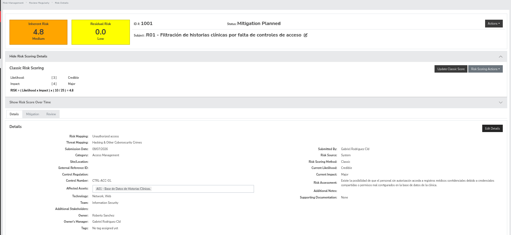
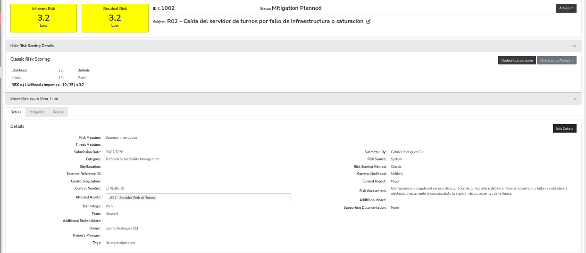
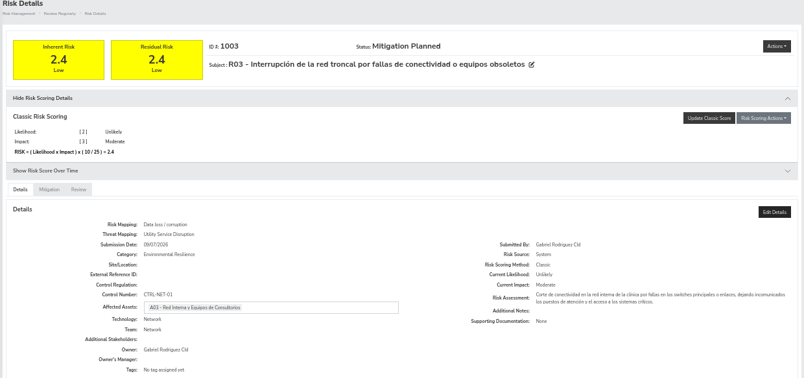
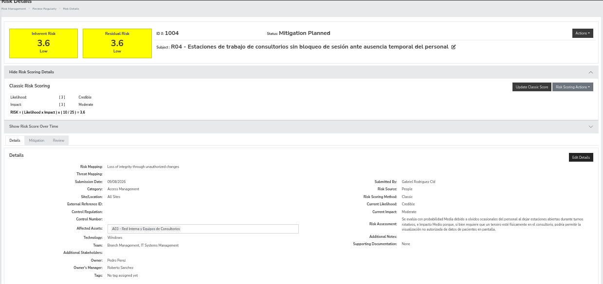
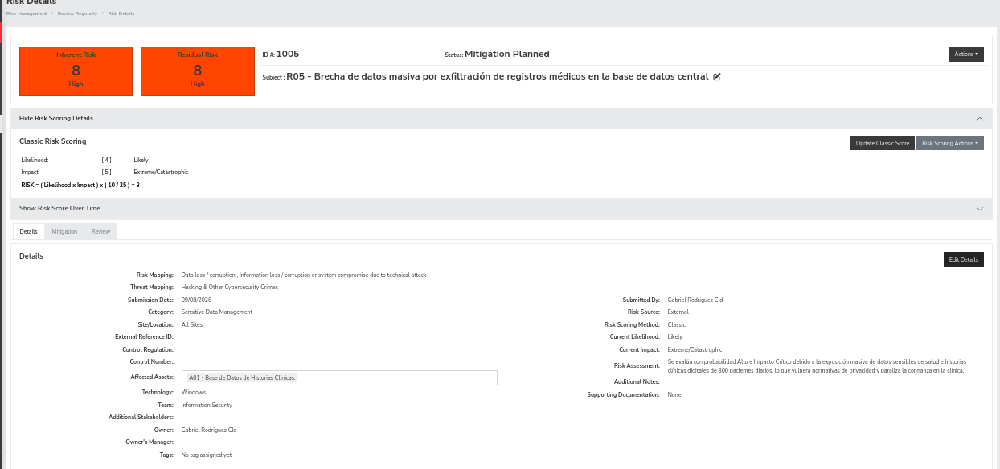

---

## 4. Definición de Planes de Acción (Mitigación)

Configuración de las estrategias de tratamiento y mitigación cargadas en la plataforma:

* **ID 1001 (R01): Filtración de historias clínicas por falta de controles de acceso**
  * *Estrategia:* Mitigate | *Esfuerzo:* Considerable | *Costo:* $0 to $100,000
  * *Solución Actual:* Control de acceso básico por usuario y contraseña genérica por rol.
  * *Requerimientos de Seguridad:* Implementación de Autenticación Multifactor (MFA), cifrado AES-256 en reposo y políticas de contraseñas robustas.

* **ID 1002 (R02): Caída del servidor de turnos por fallo de infraestructura**
  * *Estrategia:* Mitigate | *Esfuerzo:* Considerable | *Costo:* $0 to $100,000
  * *Solución Actual:* Servidor web operativo en una única instancia local sin redundancia ni balanceo de carga.
  * *Requerimientos de Seguridad:* Implementación de alta disponibilidad, respaldos automáticos diarios y plan de recuperación ante desastres (DRP).

* **ID 1003 (R03): Interrupción de la red troncal**
  * *Estrategia:* Mitigate | *Esfuerzo:* Considerable | *Costo:* $0 to $100,000
  * *Solución Actual:* Red troncal operando con equipos estándar sin redundancia de enlaces ni segmentación de tráfico crítico.
  * *Requerimientos de Seguridad:* Implementación de enlaces redundantes de respaldo (failover), segmentación mediante VLANs y switches administrables.

* **ID 1004 (R04): Estaciones de trabajo sin bloqueo**
  * *Estrategia:* Mitigate | *Esfuerzo:* Minor | *Costo:* $0 to $100,000
  * *Solución Actual:* Implementar GPO en equipos Windows para forzar bloqueo automático a los 5 minutos de inactividad.
  * *Requerimientos de Seguridad:* Exigir cumplimiento de la política de bloqueo de sesión (atajo Windows + L).

* **ID 1005 (R05): Brecha de datos masiva en BD central**
  * *Estrategia:* Mitigate | *Esfuerzo:* Significant | *Costo:* $100,001 to $200,000
  * *Solución Actual:* Aplicar cifrado AES-256 en base de datos central (A01), restringir accesos por mínimo privilegio y respaldos fuera de línea inmutables.
  * *Requerimientos de Seguridad:* Proteger confidencialidad e integridad mediante cifrado en reposo y en tránsito.

* **ID 1006 (R06): Demora en actualización de credenciales de baja**
  * *Estrategia:* Mitigate | *Esfuerzo:* Minor | *Costo:* $0 to $100,000
  * *Solución Actual:* Establecer procedimiento formal y checklist obligatorio entre RRHH y Sistemas para desactivación inmediata de credenciales.

* **ID 1007 (R07): Falta de parches en Servidor Web**
  * *Estrategia:* Mitigate | *Esfuerzo:* Considerable | *Costo:* $0 to $100,000
  * *Solución Actual:* Establecer procedimiento periódico de revisión y aplicación de parches de seguridad en ventanas de mantenimiento fuera de horario.

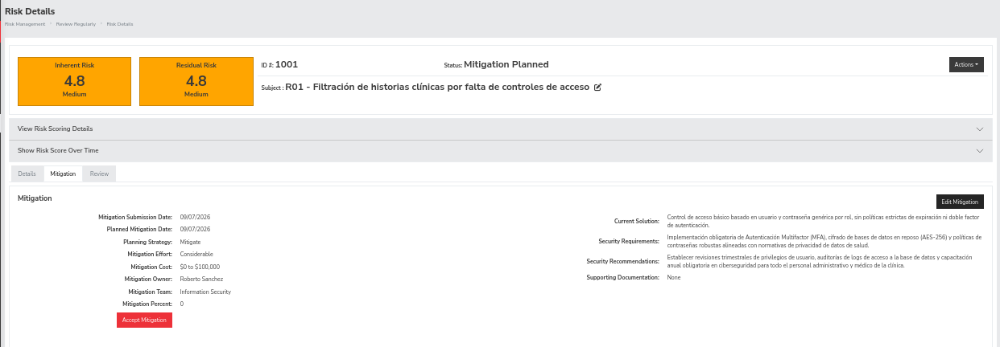
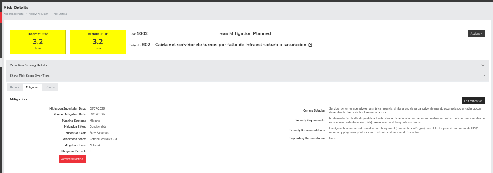
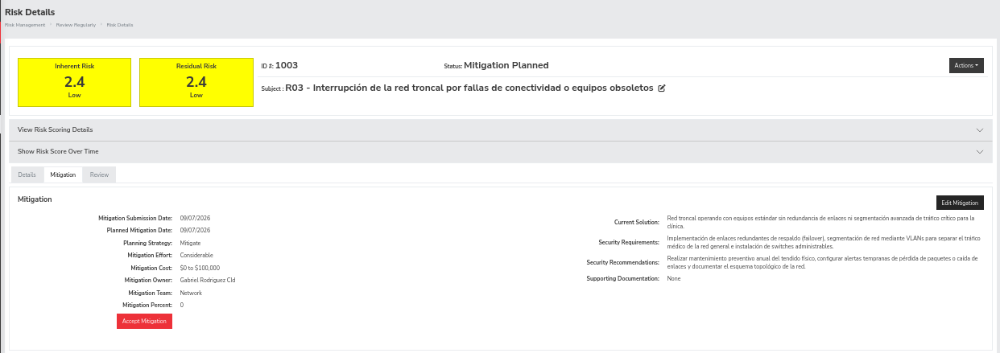
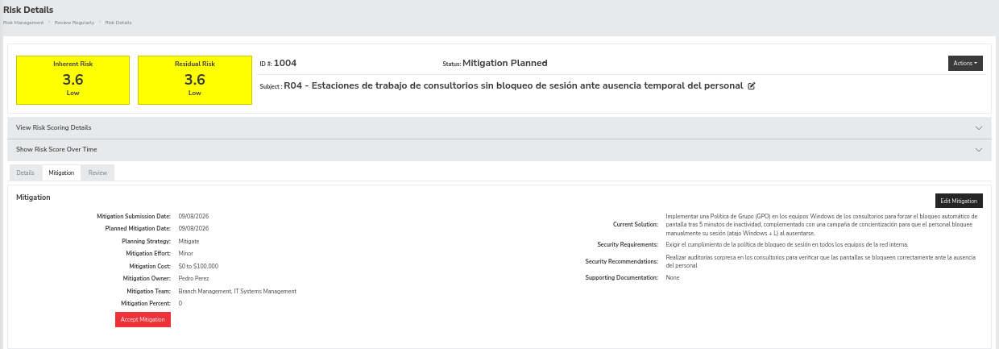
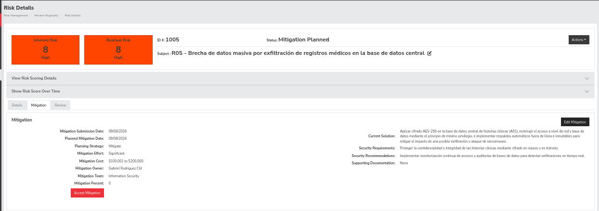
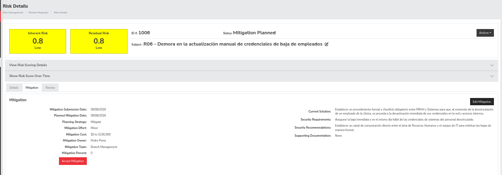
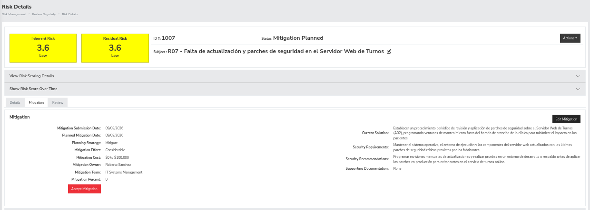

### 5. SimpleRisk (Matriz Cualitativa $5 \times 5$) vs. ISO 27005 (Gestión de Riesgos de Seguridad de la Información)

| Aspecto | SimpleRisk (Matriz $5 \times 5$) | ISO 27005 (Enfoque Basado en Activos y Escenarios) |
| :--- | :--- | :--- |
| **Tipo de Análisis** | Cualitativo / Semicuantitativo basado en juicio experto. | Sistemático, estructurado por fases (Contexto, Evaluación, Tratamiento, Aceptación). |
| **Resultado/Métrica** | Niveles discretos (Bajo, Medio, Alto, Crítico) derivados de $P \times I$. | Análisis de riesgos contextualizado frente a los objetivos de negocio y apetito al riesgo. |
| **Ventajas** | Rápida implementación, visualización inmediata y facilidad de adopción por equipos de IT. | Marco formal e internacionalmente reconocido; alineado con ISO 27001, exhaustivo y auditable. |
| **Desventajas** | Cierta subjetividad en la asignación numérica de probabilidad e impacto. | Requiere mayor documentación formal, tiempo de análisis y burocracia de procesos. |
| **Caso de Uso** | Operaciones diarias de IT, pymes, startups y priorización ágil de incidentes. | Grandes organizaciones, entornos regulados (como salud o finanzas) y auditorías de certificación. |

### Integración Externa y Monitoreo
SimpleRisk permite la integración avanzada mediante el reenvío de registros de auditoría hacia un servidor **Syslog** centralizado y sistemas **SIEM** (como Wazuh o ELK Stack). Para este entorno clínico, se configuró la exportación de eventos de seguridad y cambios en la matriz de riesgos mediante Syslog en formato CEF (Common Event Format). Esto permite que cualquier alteración crítica en los activos sea correlacionada en tiempo real por el equipo de operaciones de seguridad (SOC) sin depender únicamente de la interfaz web del GRC.